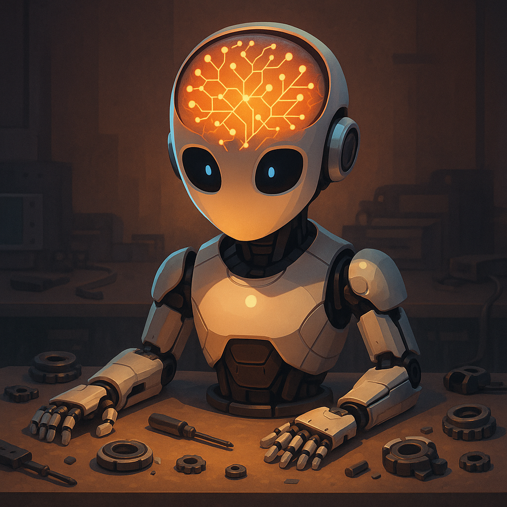

# OpenClaw搭建与配置系列预告：从零开始，给你的AI助手装上大脑

说实话，刚开始接触 OpenClaw 的时候，我是有点懵的。

文档很全，功能很多，但面对那一堆配置文件和 provider、model、channel 的概念，我还是花了好几天才搞明白它们之间的关系。后来我慢慢发现，OpenClaw 就像是在搭积木——先搭好底座（模型），再装上嘴巴（对话通道），然后给它配上眼睛（看图）、手（浏览器）、耳朵（语音）……最后它才能真正成为一个能干活、会思考的助手。

这个系列，我想把这半个月踩过的坑、理顺的逻辑，一次性讲清楚。

## 这个系列要讲什么？

整个「搭建与配置」系列一共 **13 篇文章**，从安装到进阶，手把手带你把 OpenClaw 配成一个真正能用的 AI 助手。

| 序号 | 文章标题 | 一句话预告 |
|------|----------|-----------|
| 1 | **OpenClaw的大脑-首次安装配置模型** | Provider 和 Model 到底啥关系？怎么配置才能让它"聪明"起来？ |
| 2 | **OpenClaw的对话-Channel的配置** | 飞书、Telegram、微信……怎么选？群聊要不要艾特？ |
| 3 | **OpenClaw获取实时信息** | 大模型知识库有延迟？给它装上 Brave Search，实时联网搜 |
| 4 | **OpenClaw看懂图片** | 多模态模型配置指南，让你的 AI 能看图说话 |
| 5 | **OpenClaw学会画画** | 内置生图 vs Skill 生图，两种方式怎么选？还有我踩过的坑 |
| 6 | **OpenClaw开口说话** | TTS 配置全攻略，让它用语音回复你 |
| 7 | **OpenClaw听懂语音** | 语音转文字，聊天时直接发语音也能识别 |
| 8 | **OpenClaw看懂视频** | 内置视频理解 vs Skill 视频分析，B站视频也能总结 |
| 9 | **OpenClaw制作视频** | 用 NotebookLM 自动生成讲解视频，还能自动发 B站 |
| 10 | **OpenClaw使用浏览器** | CDP 协议操作浏览器，自动登录、填表、爬数据 |
| 11 | **记住重要的事情** | MEMORY.md、AGENTS.md……这些文件到底是干嘛的？ |
| 12 | **追忆过去** | Memory Search + Session Logs，让 AI 记得你们聊过什么 |

（等等，我好像数错了……算了，反正就是十几篇，够你看的）

## 为什么是"搭建与配置"而不是"安装教程"？

因为我发现 OpenClaw 和其他软件不太一样——装完只是开始，**配置才是重头戏**。

比如：
- 你想让它用 Kimi 还是 GPT？（Provider 配置）
- 你想在飞书聊还是 Telegram 聊？（Channel 配置）
- 你想让它能看图、能画画、能说话吗？（能力开关）
- 你想让它记住你的喜好吗？（记忆配置）

每一篇都会给出**具体的配置代码**，以及我实际使用中的**踩坑经验**。

## 这个系列适合谁？

- 刚安装 OpenClaw，不知道从何配置起的新手
- 配置了一段时间，但总觉得哪里没搞明白的半熟用户
- 想看别人是怎么把 OpenClaw 调教成"得力助手"的围观群众

## 写作风格说明

我不会写成那种"步骤1、步骤2、步骤3"的说明书。

我更想写成**技术日记**——我在配置过程中遇到了什么问题、怎么解决的、为什么要这么配。有时候可能会吐槽两句，有时候可能会多聊几句原理。总之，轻松点，像聊天一样把这个东西讲清楚。

## 下一篇预告

下一篇我们从头开始：**《OpenClaw的大脑-首次安装配置模型》**

Provider 和 Model 的关系，我会用一个不太恰当但容易理解的比喻来讲清楚。同时给你一套我自己在用的配置模板，复制粘贴就能跑起来。

---

如果你也在用 OpenClaw，或者正准备入手，欢迎关注这个系列。

有问题也可以在飞书群里 @ 我，或者等我写完某篇你发现有问题，随时指出。技术文章嘛，大家一起打磨才好看。

我们下一篇见。
