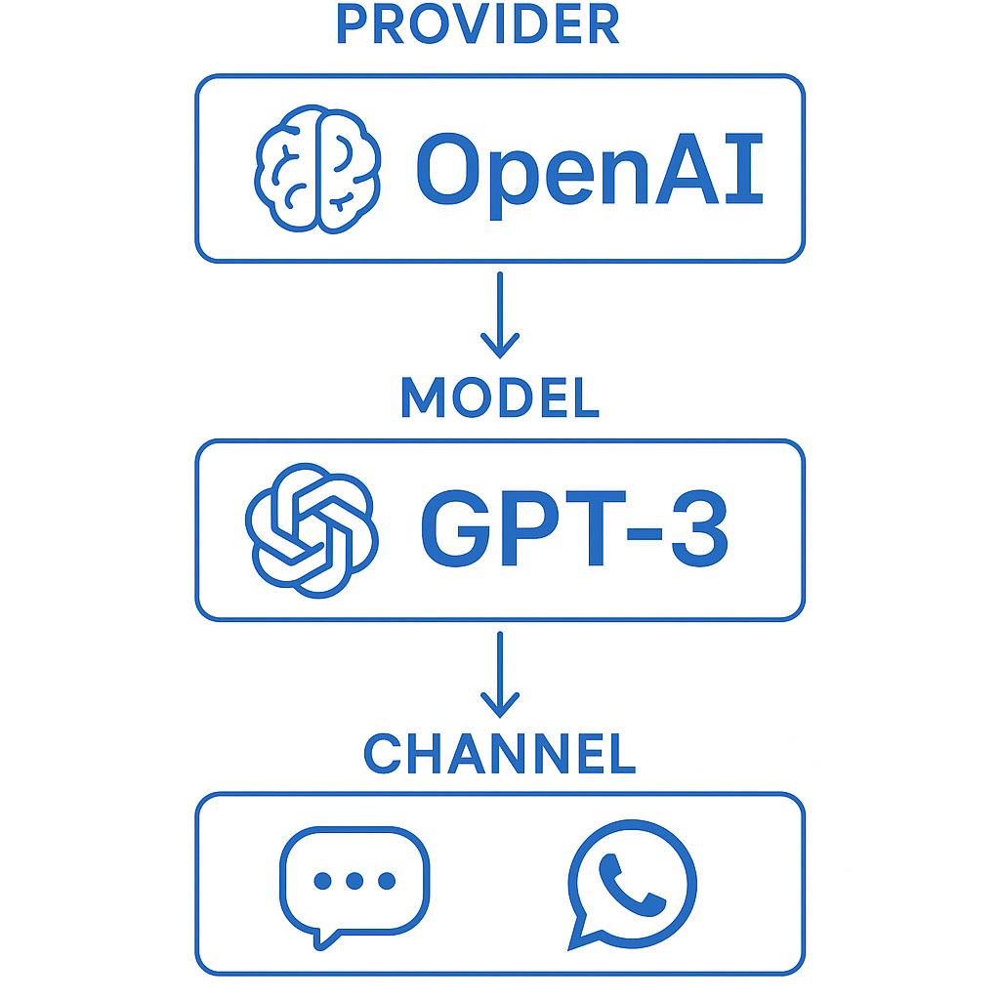
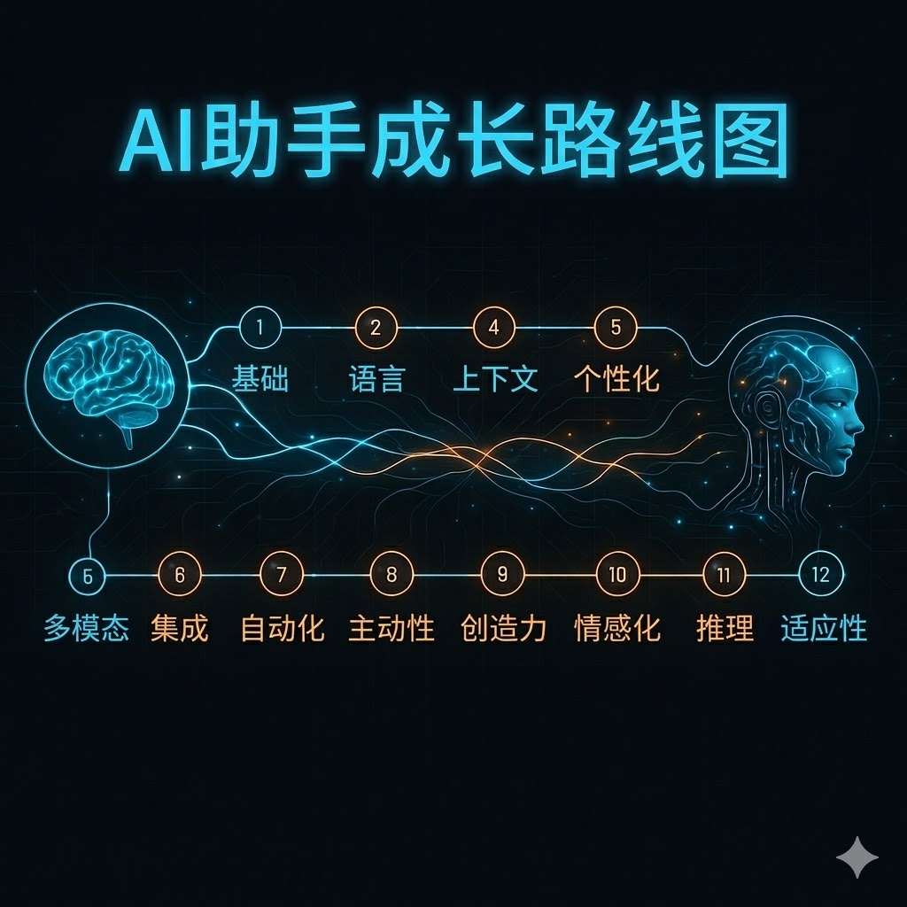

# OpenClaw搭建与配置系列预告：零基础手把手，13步配出你的AI助手

先跟你说个数据：OpenClaw 的官方文档足足有 **10 多万字**，配置文件涉及 **40+ 个配置项**，而你在网上能搜到的教程，要么是「改改 config 就行」一句话带过，要么是直接甩给你一份几百行的配置代码，告诉你「复制粘贴就能用」。

**但你复制粘贴之后呢？**报错。然后你对着报错信息一脸懵，不知道哪里错了，更不知道为什么这么配。

我刚开始接触 OpenClaw 的时候也是这样。花了整整 **3 天** 才搞明白 Provider、Model、Channel 这三个概念到底啥关系—— Provider 是「大脑供应商」（比如 OpenAI、Kimi、Gemini），Model 是「具体型号」（比如 GPT-4、Kimi-K2.5），Channel 是「嘴巴」（飞书、Telegram、微信）……理顺之前，它们在我脑子里就是一团浆糊。

**这个系列，我想把这半个月踩过的坑、理顺的逻辑，一次性讲清楚。**

## 这个系列能给你什么？

我承诺你三件事：

1. **零基础友好**——不需要你有大模型背景，我会把每个概念掰碎了讲
2. **手把手教学**——每一步都有具体配置代码，复制粘贴就能跑，同时告诉你为什么这么配
3. **13篇文章，13个里程碑**——每读完一篇，你的 OpenClaw 就多一个能力

| 进度 | 文章标题 | 读完这篇你会获得 |
|:----:|----------|----------------|
| 1/13 | **预告**（就是这篇） | 对整个配置流程有清晰地图 |
| 2/13 | **第1课：给它装个大脑** | 配置好 Provider 和 Model，能让它「听懂人话」 |
| 3/13 | **第2课：让它开口说话** | 连上飞书/Telegram，能正常聊天 |
| 4/13 | **第3课：打破知识茧房** | 装上搜索，能查今天的天气/新闻 |
| 5/13 | **第4课：睁眼看世界** | 多模态配置，能分析你发的截图 |
| 6/13 | **第5课：不只看得懂，还能画得出** | 文生图配置，能生成配图 |
| 7/13 | **第6课：让AI开口** | TTS 配置，能用语音回复 |
| 8/13 | **第7课：不只是打字聊天** | STT 配置，能识别你发的语音消息 |
| 9/13 | **第8课：看视频不用自己看** | 视频分析配置，能总结 B 站视频内容 |
| 10/13 | **第9课：从文案到成片** | NotebookLM 配置，能自动生成讲解视频 |
| 11/13 | **第10课：给它一双手** | 浏览器工具配置，能自动操作网页 |
| 12/13 | **第11课：告别"金鱼记忆"** | 记忆系统配置，能记住你的喜好和历史对话 |
| 13/13 | **第12课：想找回半年前的对话？** | 全文搜索配置，能找回历史对话和记忆 |

**进度提示：你正在看 1/13，是整趟旅程的起点。**

## 先给你打个预防针

说实话，OpenClaw 的配置确实有点复杂。不是「一键安装」那种傻瓜式操作，你需要：
- 编辑 JSON 配置文件（别怕，我会告诉你每个字段干啥的）
- 申请几个 API Key（Brave、飞书、Gemini……）
- 有时候还得改改环境变量

**但好消息是：**每篇文章只解决一个问题，你只需要跟着走，一次配一点，**13 篇看完，你就有一个真正能干的 AI 助手了**。

那些看起来很吓人的报错（比如 `No provider registered`、`Connection refused`），我都会在文章里提前告诉你怎么解决。

## 这个系列适合谁？

- **刚安装 OpenClaw，不知道从何配置起的新手**——你最需要这个系列
- **配置了一段时间，但总觉得哪里没搞明白的半熟用户**——帮你理清概念
- **想给团队/朋友部署 OpenClaw 的技术人**——直接拿这个系列当教材

## 正文里你能期待什么？

每篇文章都会包含：
- **概念解释**——用你能听懂的比喻讲清楚
- **配置代码**——完整的、测试过的配置，带注释
- **验证步骤**——配完怎么测试，预期看到什么结果
- **踩坑记录**——我遇到的报错和解决方案
- **进度庆祝**——这一步搞定了，给你打个勾 ✅

## 下一篇：正式开工

准备好开始了吗？下一篇 **《第1课：给它装个大脑——Provider和Model配置入门》**，我们从头开始，把 Provider 和 Model 的关系讲明白。

**进度：2/13，真正的配置从下一篇开始。**

---

如果你在看这篇文章的时候已经有点懵了——比如「Provider 是啥」「Model 又是啥」——完全正常，我刚开始也是懵的。**跟着这个系列走，13 篇之后，你就是那个能教别人的人。**

我们下一篇见。
