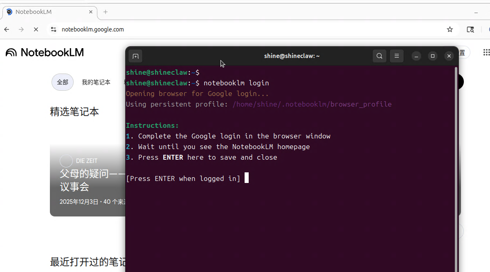
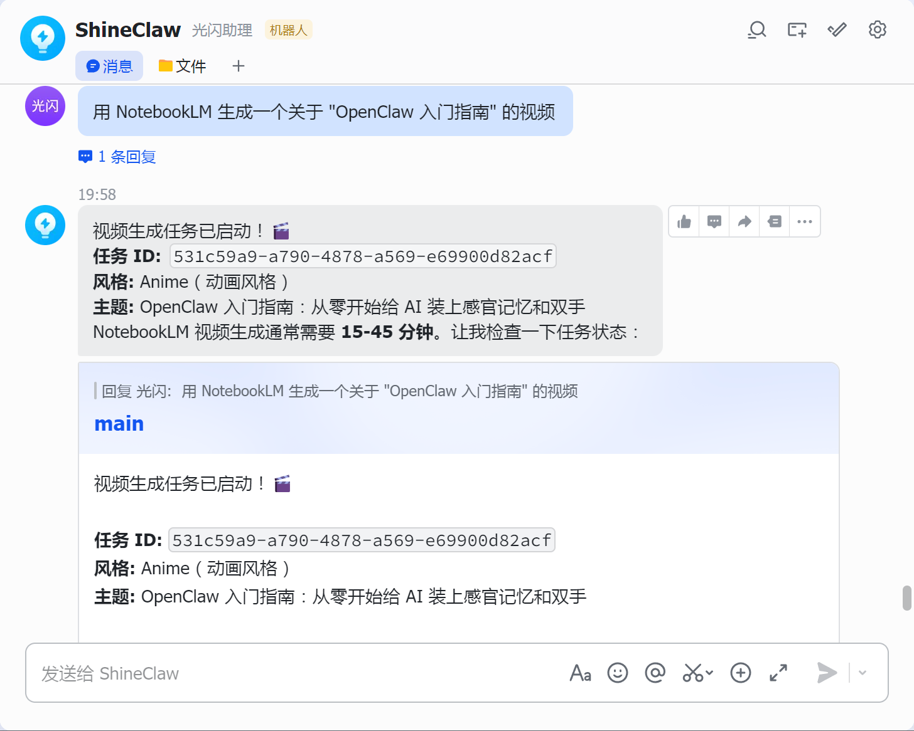
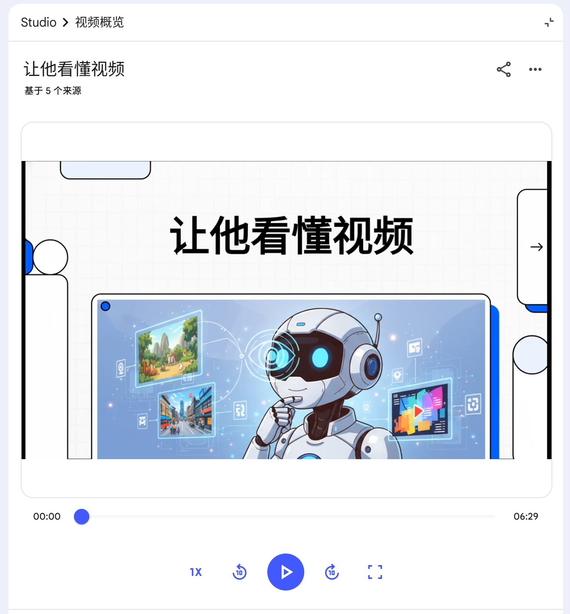

# 第9课：学会制作视频——视频生成功能配置

> **进度：9/12，你的AI即将「制作视频」**

你有没有遇到过这种情况：

- 写了一篇很棒的技术博客，想做成视频发B站，但剪辑太费时间...
- 录了一个小时的会议，需要整理成5分钟的干货视频...
- 想做一个知识科普视频，但不想出镜、不想录音、不想剪辑...

**如果AI能帮你把文字直接变成视频，你会用吗？**

这节课，我们要给 OpenClaw 装上「制作视频」的能力。配置好之后，你只需要丢给它一篇文章、一份笔记，甚至一个主题，它就能自动生成一个完整的讲解视频——带画面、有配音、配字幕，直接能发布的那种。

这节课完成后，你的 AI 将能：
- 📝 **自动整理素材**——把零散笔记变成结构化的讲解脚本
- 🎬 **生成讲解视频**——AI自动生成画面和配音
- 🎙️ **多语言配音**——支持中文、英文等多种语言
- ⚡ **一键发布**——生成后直接上传到视频平台

---

## 准备工作

这节课你需要：
- ✅ 已经配置好的 OpenClaw（前8课的内容）
- ✅ Google 账号（用于登录 NotebookLM）
- ✅ 大约 20 分钟时间

**不需要：**
- ❌ 付费（NotebookLM 目前是免费的）
- ❌ 高性能显卡（视频生成在云端完成）
- ❌ 视频剪辑技能（AI全包）

---

## 先搞明白：NotebookLM 是什么？

**NotebookLM** 是 Google 推出的一款 AI 研究和笔记工具，它的核心功能是：

> 上传你的资料（文档、笔记、网页链接），AI 会帮你整理、总结、问答，甚至**生成一段讲解视频**。

这个生成的视频叫 **"Audio Overview"**，形式是两个 AI "主持人" 以对话的形式讲解你的材料，配上背景音乐，听起来就像一档播客节目。

**为什么用它来做视频？**

| 优势 | 说明 |
|------|------|
| **免费** | 目前完全免费，没有额度限制 |
| **质量高** | 生成的语音自然流畅，不像机器人 |
| **零门槛** | 不需要写脚本、不需要剪辑 |
| **多语言** | 支持中文、英文等多种语言 |

---

## 第一步：安装依赖

这节课需要安装几个工具，都是一键安装，跟着做就行。

### 1.1 安装 uv（Python 包管理器）

如果你前几节课已经装过了，可以跳过。

```bash
# macOS
brew install uv

# Linux
curl -LsSf https://astral.sh/uv/install.sh | sh
```

验证安装：
```bash
uv --version
```

### 1.2 安装 notebooklm-py

这是 NotebookLM 的 Python 客户端，让我们可以用命令行操作：

```bash
uv tool install "notebooklm-py[browser]"
```

**注意**：带 `[browser]` 表示安装浏览器支持，后面登录需要。

验证安装：
```bash
notebooklm --version
```

### 1.3 安装 Playwright（浏览器自动化）

Playwright 是用来控制浏览器的工具，notebooklm-py 靠它来模拟登录：

```bash
uv tool install playwright
playwright install chrome
```

**说明**：
- `playwright install chrome` 会下载一个独立的 Chromium 浏览器
- 大概需要 100MB+ 空间，耐心等待

---

## 第二步：登录 NotebookLM

### 2.1 执行登录命令

```bash
notebooklm login
```

运行后会自动打开浏览器（或弹出一个窗口），显示 Google 登录页面。




### 2.2 完成 Google 授权

1. 选择你的 Google 账号（建议用小号，不确定 Google 是否会根据行为封号）
2. 允许 NotebookLM 访问权限
3. 看到 "授权成功" 或类似提示后，可以关闭浏览器

回到终端，你应该能看到类似这样的提示：

```
✓ Successfully logged in as: your-email@gmail.com
```

---

## 第三步：安装 Skill

### 3.1 下载 Skill 文件

这个 Skill 需要手动安装。从仓库下载：

```bash
git clone https://github.com/HikariShine/AgentStudy.git
cp -r AgentStudy/skills/tiangong-notebooklm-cli ~/.openclaw/skills/
```

或者直接下载压缩包解压到 `~/.openclaw/skills/tiangong-notebooklm-cli/`。

### 3.2 目录结构确认

安装完成后，目录结构应该是：

```
~/.openclaw/skills/
└── tiangong-notebooklm-cli/
    ├── SKILL.md
    ├── skill.json
    └── scripts/
        └── notebooklm.mjs
```

### 3.3 重启 OpenClaw

```bash
openclaw gateway restart
```

---

## 第四步：测试视频生成

现在来测试一下效果！

### 4.1 基本用法：指定主题生成

**你发送：**
```
用 NotebookLM 生成一个关于 "OpenClaw 入门指南" 的视频
```

**AI 会执行：**
1. 创建一个 NotebookLM 项目
2. 生成相关的学习材料
3. 添加到项目中
4. 生成讲解视频
5. 返回视频链接（视频生成需要耗时比较久，如果1个小时没有响应，可以主动问一下视频是否生成成功）




### 4.2 用自己的材料生成

如果你已经有现成的文档（Markdown、PDF、网页链接），可以直接用：

**你发送：**
```
把我 workspace/agent/docs/intro.md 这篇文章做成视频
```

或者：

**你发送：**
```
基于这几个链接生成视频：
- https://docs.openclaw.ai/
- https://github.com/openclaw/openclaw
```

### 4.3 查看生成的视频

生成完成后，AI 会返回一个链接：

**AI 回复：**
```
🎬 视频生成完成！

**视频主题：** OpenClaw 入门指南
**时长：** 约 8 分钟
**语言：** 中文

**在线观看：** https://notebooklm.google.com/notebook/xxx

**视频内容概要：**
- 介绍了 OpenClaw 是什么
- 讲解了核心功能特点
- 演示了基础使用场景
- 给出了入门学习路径

**如何下载？**
你可以点击链接进入 NotebookLM，在视频播放页面右键 → "另存为" 保存 MP3 音频，或者使用浏览器插件下载视频版本。
```

这里也可以直接让OpenClaw帮你下载到本地，直接告诉他就行。




---

## 进阶用法

### 5.1 指定语言

NotebookLM 支持多种语言，可以在生成时指定：

**你：** "生成一个英文版的视频"

**你：** "用中文生成，但保留专业术语的英文"

### 5.2 控制视频风格

虽然 NotebookLM 的格式相对固定（双人对话形式），但你可以通过源材料影响风格：

| 源材料类型 | 生成效果 |
|-----------|---------|
| 技术文档 | 偏知识讲解，干货满满 |
| 故事/案例 | 偏叙述性，更有趣味性 |
| 论文/报告 | 偏学术风格，严谨专业 |
| 博客文章 | 偏轻松，像朋友聊天 |

同时你还可以给他指定多种内置风格，如水彩、动画、可爱等，你可以问他都有哪些风格。

### 5.3 批量生成系列视频

有一系列主题想做视频？批量处理：

**你：** "帮我把 memory/ 目录下的这3篇文章都做成视频：
1. OpenClaw安装指南.md
2. 模型配置技巧.md
3. Skill开发入门.md"

### 5.4 配合其他功能

**文章 + 视频：**
> "把我刚才写的文章生成视频，然后分析一下视频适合发哪个平台"

**视频 + 封面图：**
> "生成视频后，再画一张封面图"

**视频 + 视频网站发布：**
> （下节课实战2会讲如何自动发布到视频网站）

---

## 常见问题 FAQ

### Q1: NotebookLM 是免费的吗？

**是的**，目前 NotebookLM 完全免费，没有额度限制。但 Google 可能会在未来调整政策，建议适度使用。

### Q2: 生成的视频是什么格式？

NotebookLM 生成的是 MP4 格式的视频，带有PPT画面和声音讲解

### Q3: 为什么登录时浏览器没弹出来？

**可能原因：**
1. 没有安装 `[browser]` 版本的 notebooklm-py
2. Playwright 没有正确安装
3. 系统缺少图形界面（服务器环境）

**解决：**
```bash
# 重新安装带浏览器支持的版本
uv tool uninstall notebooklm-py
uv tool install "notebooklm-py[browser]"
playwright install chrome
```

如果是服务器环境，可以先在本地登录，然后把登录信息同步到服务器。

### Q4: 生成的视频可以商用吗？

NotebookLM 的服务条款目前允许个人使用，**商业用途建议：**
- 仔细阅读 Google 的最新条款
- 考虑使用其他商业化方案

### Q5: 视频生成需要多久？

取决于材料长度：
- 简单文章（1000字）：10-30分钟
- 复杂文档（上万字）：15-45分钟

AI 会在生成过程中显示进度。

### Q6: 可以自定义视频的声音吗？

目前 NotebookLM 的声音是固定的（男声或者女声），**暂时不支持自定义音色**。

如果需要特定音色，可以考虑：
- 使用其他 TTS 工具（如 ElevenLabs）
- 用 OpenClaw 的 TTS 功能（第6课）自己配音

### Q7: Skill 安装后没有生效？

**排查步骤：**
1. 确认目录结构正确
2. 重启 OpenClaw
3. 检查日志：`openclaw logs`
4. 确认 notebooklm 命令可用：`which notebooklm`

### Q8: 可以生成多长的视频？

NotebookLM 会根据你的材料长度自动决定视频时长：
- 简单主题：3-5分钟
- 复杂主题：10-15分钟
- 超长材料：可能会被压缩到 15-20 分钟

### Q9: 生成的视频质量怎么样？

**优点：**
- 语音自然流畅，不像机器人
- 内容结构清晰，有逻辑性
- 会自动提炼重点

**局限：**
- 是音频播客形式，画面是简单的PPT
- 声音是固定的，不能自定义

---

## 进阶技巧

### 技巧1：优化源材料，提升视频质量

NotebookLM 的视频质量很大程度上取决于源材料的质量：

**好的源材料：**
- 结构清晰（有标题、段落分明）
- 内容丰富（有足够的细节和例子）
- 逻辑连贯（有明确的主线）

**不好的源材料：**
- 只有大纲，没有内容
- 太多链接，没有实质内容
- 过于零散，没有主题

### 技巧2：多轮优化

第一轮生成后，如果不满意，可以让 AI 调整：

**你：** "这个视频讲得太浅了，能不能加入更多技术细节？"

**你：** "视频太长了，能不能压缩到5分钟内？"

### 技巧3：做自己的「视频生成流水线」

创建一个完整的工作流：

```
写博客文章 → AI 生成视频 → 下载音频 → 配上封面图 → 发布到B站
```

配合 OpenClaw 的其他能力，这个流程可以全自动化！

### 技巧4：结合其他 AI 工具

NotebookLM 负责生成音频内容，其他工具负责画面：

- **PPT 生成**：用 Gamma、Tome 等工具生成配图
- **视频剪辑**：用剪映、CapCut 自动剪辑
- **字幕生成**：用 Whisper 自动生成字幕

### 技巧5：快速测试不同主题

想测试某个主题是否适合做视频？

**你：** "用 NotebookLM 快速生成一个关于 'XXX' 的视频，看看效果"

5分钟后就知道这个主题的内容丰富度如何。

---

## 总结：你现在拥有了什么？

🎉 **恭喜你，你的 OpenClaw 能「制作视频」了！**

回顾这 9 节课的成果：

| 课程 | 能力 | 状态 |
|------|------|------|
| 第1课 | 大脑（模型配置） | ✅ 能思考、能推理 |
| 第2课 | 嘴巴（飞书接入） | ✅ 能接收和发送消息 |
| 第3课 | 耳朵（实时搜索） | ✅ 能获取最新信息 |
| 第4课 | 眼睛（图片理解） | ✅ 能看懂图片 |
| 第5课 | 双手（文生图） | ✅ 能生成图片 |
| 第6课 | 嗓子（语音回复） | ✅ 能开口说话 |
| 第7课 | 耳朵（语音识别） | ✅ 能听懂语音 |
| 第8课 | 眼睛（视频分析） | ✅ 能看懂视频 |
| **第9课** | **导演（视频生成）** | **✅ 能制作视频** |

**现在你的 AI 已经具备了「创作能力」**：
- 不仅能理解世界（看懂图片、听懂语音、分析视频）
- 还能创造内容（生成图片、合成语音、制作视频）

**这已经不再是一个简单的助手，而是一个真正的「AI 创作伙伴」**。

下节课，我们要更进一步——给 OpenClaw 装上「一双手」，让它能直接操作浏览器，完成更复杂的任务...

---

## 课后作业

试试这些视频玩法：

1. **文章转视频**：把你写过的一篇博客转成视频
2. **知识总结**：整理一份学习笔记，生成讲解视频
3. **系列视频**：做一个 3 集的系列视频（每集一个主题）

遇到问题随时在群里提问。

---

**下节预告：** 第10课《给它一双手——浏览器自动化操作配置》，教你的 AI 如何像人类一样操作浏览器，实现真正的「自动化」！

*进度：9/12 已完成 ✅*

---

*文章作者：光闪*  
*系列：OpenClaw 搭建与配置*  
*发布日期：2026-04-09*
