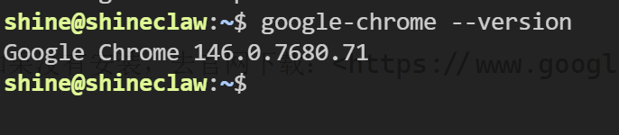
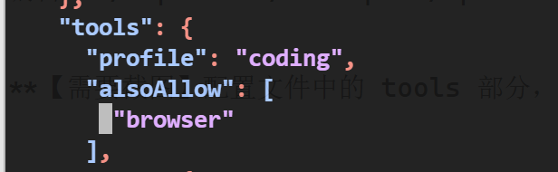
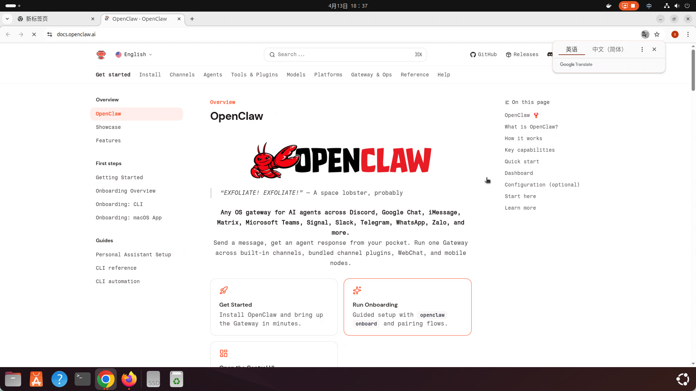
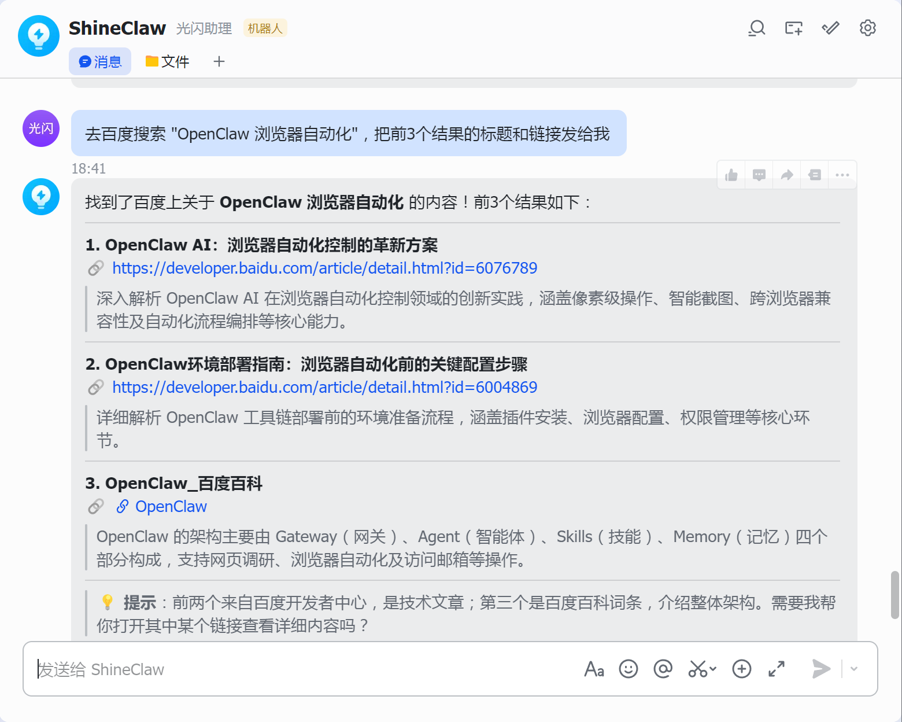
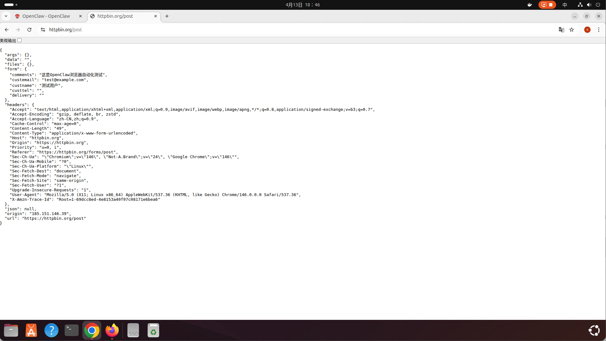

# 第10课：给它一双手——浏览器自动化操作配置

> **进度：10/12，你的AI即将「拥有一双手」**

想查个资料，得自己打开浏览器、搜索、筛选结果；想预订个餐厅，得翻好几页、填表单；想监控某个网页的变化，得时不时手动刷新...

这些重复又枯燥的浏览器操作，能不能让AI代劳？

如果AI能像人类一样「看」网页、「点」按钮、「填」表单，甚至「翻」页签，你愿不愿意试试？

这节课给 OpenClaw 装上「一双手」。配置好以后，你只需说「帮我查一下XX的价格」「去这个网站帮我提交表单」，AI就能自动操控浏览器完成任务——像你的数字助理一样。

学完这节课，你的AI能做到：
- 自动浏览网页，搜索和提取信息
- 操作网页表单，完成填写和提交
- 截图查看页面状态，像人眼一样"看见"网页
- 模拟点击、滚动、输入等交互动作

---

## 准备工作

这节课需要：
- 配置好的 OpenClaw（前9课内容）
- Chrome 或 Chromium 浏览器（新版 Edge 也可以）
- 大约 15 分钟时间

不需要：
- 额外付费（浏览器控制是 OpenClaw 内置功能）
- 编程知识（全程自然语言交互）
- 复杂的环境配置

---

## 浏览器自动化是什么？

**浏览器自动化** = 让程序像人类一样控制浏览器：打开网页、点击元素、填写表单、滚动页面、截图查看...

OpenClaw 使用 **CDP（Chrome DevTools Protocol）** 协议与浏览器通信。这是 Chrome 内置的开发者工具协议，可以实现像素级的浏览器控制。

**为什么需要这个功能？**

| 场景 | 传统方式 | 浏览器自动化 |
|------|---------|-------------|
| 查资料 | 自己打开N个网页搜索 | AI自动搜索汇总 |
| 填表单 | 手动输入、反复检查 | AI自动识别填写 |
| 数据监控 | 定时人工检查 | AI自动截图汇报 |
| 比价购物 | 多网站反复对比 | AI一键抓取对比 |

**核心优势：**
- 所见即所得：AI能"看见"网页，不是只读HTML
- 交互自然：说人话就能操作，不用写代码
- 安全可靠：本地浏览器，数据不上传

---

## 第一步：安装依赖

### 1.1 确认浏览器已安装

**检查 Chrome/Chromium：**
```bash
# macOS
/Applications/Google/Chrome.app/Contents/MacOS/Google/Chrome --version

# Linux
google-chrome --version
# 或
chromium --version
```

如果没有安装，去官网下载：<https://www.google.com/chrome/>




### 1.2 启用浏览器工具

浏览器工具默认关闭，需要在配置中开启：

```json
{
  "tools": {
    "alsoAllow": [
      "browser"
    ]
  }
}
```

**配置方式：**

**命令行配置：**
```bash
openclaw configure --section tools --key alsoAllow --value '["browser"]'
```

**或直接修改配置文件：**

编辑 `~/.openclaw/workspace/openclaw.json`，在 `tools` 部分添加 `alsoAllow` 数组。



---

## 第二步：配置浏览器 Profile

OpenClaw 使用 **Profile（配置文件）** 来管理浏览器会话。可以理解为：不同的 Profile = 不同的"浏览器身份"。

### 2.1 新版默认配置（推荐）

从 **2026.03.23 版本** 开始，OpenClaw 内置了两套默认 Profile，无需手动添加配置：

| Profile 名称 | 用途 | 特点 |
|-------------|------|------|
| `user` | 使用你的主浏览器 | 共享你的登录态、Cookie、书签 |
| `openclaw` | AI专用独立浏览器 | 干净环境，隔离隐私 |

**默认配置如下：**

```json
{
  "browser": {
    "profiles": {
      "user": {
        "cdpPort": 18792,
        "driver": "existing-session",
        "color": "#0066CC"
      },
      "openclaw": {
        "cdpPort": 18800,
        "color": "#FF4500"
      }
    }
  }
}
```

**字段说明：**
- `cdpPort`：CDP 协议通信端口，每个 Profile 需不同
- `driver`：驱动类型，`existing-session` 表示连接已有浏览器
- `color`：浏览器边框颜色，方便区分

### 2.2 选择使用哪个 Profile

**使用 `user` Profile（推荐日常用）：**
- ✅ 已登录的网站（知乎、GitHub、邮箱等）AI能直接访问
- ✅ 保留你的个人设置和插件
- ⚠️ 注意：AI可以操作你浏览器里的所有内容

**使用 `openclaw` Profile（推荐敏感操作）：**
- ✅ 干净环境，不泄露个人隐私
- ✅ 适合测试、自动化脚本
- ⚠️ 需要重新登录各种网站

---

## 第三步：测试浏览器控制

### 3.1 基础用法：打开网页

**你发送：**
```
打开浏览器，访问 https://docs.openclaw.ai
```

**AI 会执行：**
1. 连接浏览器（通过 CDP 协议）
2. 打开新标签页
3. 导航到指定网址
4. 返回页面标题和状态

**AI 回复示例：**

已成功打开 OpenClaw 官方文档 🦞

页面主要内容包括：

**顶部导航**
- GitHub、Releases、Discord 链接
- 搜索功能（⌘K）
- 暗黑模式切换

**主导航菜单**
- Get started / Install / Channels / Agents / Tools & Plugins / Models / Platforms / Gateway & Ops / Reference / Help

**当前页面亮点**
- **OpenClaw 简介**：自托管网关，连接 Discord、Telegram、Signal、WhatsApp、飞书等聊天应用到 AI 助手
- **快速开始**（3步）：
  1. `npm install -g openclaw@latest`
  2. `openclaw onboard --install-daemon`
  3. `openclaw dashboard` 打开控制台
- **核心功能**：多频道网关、插件频道、多代理路由、媒体支持、Web 控制台、移动节点

需要我点击某个特定章节或帮你查找文档中的具体内容吗？




### 3.2 进阶用法：搜索信息

**你发送：**
```
去百度搜索 "OpenClaw 浏览器自动化"，把前3个结果的标题和链接发给我
```

**AI 执行流程：**
1. 打开百度
2. 找到搜索框
3. 输入关键词并搜索
4. 提取搜索结果
5. 返回整理后的信息



### 3.3 交互用法：填写表单

**你发送：**
```
打开 https://httpbin.org/forms/post 这个表单页面，帮我填写：
- 姓名：测试用户
- 邮箱：test@example.com
- 留言：这是OpenClaw浏览器自动化测试
然后提交表单
```

**AI 执行流程：**
1. 打开目标页面
2. 识别表单字段
3. 依次填写内容
4. 点击提交按钮
5. 返回提交结果





---

## 第四步：浏览器工具详解

### 4.1 支持的操作类型

| 操作 | 说明 | 示例指令 |
|-----|------|---------|
| `navigate` | 导航到URL | "打开 https://xxx.com" |
| `click` | 点击元素 | "点击搜索按钮" |
| `type` | 输入文本 | "在搜索框输入 xxx" |
| `scroll` | 滚动页面 | "向下滚动" |
| `screenshot` | 页面截图 | "截图看看" |
| `extract` | 提取内容 | "提取页面正文" |
| `wait` | 等待加载 | "等页面加载完" |
| `close` | 关闭标签页 | "关闭这个页面" |

### 4.2 智能元素识别

你不需要告诉AI精确的CSS选择器，用自然语言描述即可：

**模糊描述 → AI识别 → 精确操作**

| 你说 | AI理解 | 实际执行 |
|-----|-------|---------|
| "点那个蓝色的按钮" | 查找蓝色按钮元素 | `click(button[data-color="blue"])` |
| "在第一个输入框填xxx" | 定位第一个input | `type(input:first, "xxx")` |
| "滚动到页面底部" | 计算滚动距离 | `scrollTo(bottom)` |

### 4.3 多标签页管理

AI可以同时管理多个标签页：

**你：** "打开3个标签页，分别搜索 OpenClaw、Claude、GPT"

**AI回复：**
```
已打开3个标签页：
- 标签页1: OpenClaw 搜索结果
- 标签页2: Claude 搜索结果  
- 标签页3: GPT 搜索结果

切换到第2个标签页查看 Claude 结果？
```

---

## 第五步：进阶用法

### 5.1 监控网页变化

让AI定期检查某个页面：

**你：** "每小时帮我查看 https://example.com/price 上的价格，如果变了就通知我"

**实现方式：**
- 配合 OpenClaw 的定时任务功能
- 自动截图对比或提取数据
- 变化时发送通知

### 5.2 自动化数据抓取

批量从网页提取结构化数据：

**你：** "打开这个商品列表页，把所有商品的名称、价格、评分提取成表格"

**AI执行：**
1. 分析页面结构
2. 识别列表项
3. 提取每个商品的字段
4. 整理成 Markdown 表格

### 5.3 自动填写复杂表单

注册账号、提交申请等场景：

**你：** "帮我在这个网站注册一个账号，用户名用 test_openclaw，密码随机生成"

**AI执行：**
1. 找到注册入口
2. 填写用户名、密码、邮箱
3. 处理验证码（如需要人工介入会提示）
4. 提交注册
5. 返回注册结果

### 5.4 配合其他功能

**浏览器 + 搜索：**
> "搜索最新的OpenClaw更新日志，把找到的内容总结一下"

**浏览器 + 生图：**
> "去 DALL-E 官网看看他们的示例图片风格，然后给我生成类似风格的图片"

**浏览器 + 视频：**
> "打开这个B站视频，看看评论区都在讨论什么"

---

## 常见问题 FAQ

### Q1: 浏览器无法连接？

**排查步骤：**
1. 确认端口一致（配置中的 `cdpPort` 与启动参数一致）
2. 检查是否有防火墙拦截
3. 重启浏览器和 OpenClaw 再试

### Q2: AI说"找不到元素"怎么办？

**可能原因：**
- 页面还没加载完 → 让AI稍等一下再试
- 描述太模糊 → 说得更具体（"红色的提交按钮"而不是"那个按钮"）
- 元素是动态加载的 → 先让AI滚动页面或等待

**技巧：**
- "先截图看看页面"
- "等页面完全加载后再点击"
- "滚动到能看到 xxx 的地方"

### Q3: 可以操作手机浏览器吗？

目前 OpenClaw 主要支持桌面版 Chrome/Chromium。手机浏览器可以通过以下方式：
- Chrome 远程调试（Android）
- Safari 远程检查（iOS，需 Mac）

配置较复杂，有需求可以单独研究。

### Q4: 浏览器操作安全吗？

**安全性说明：**
- 所有操作在本地浏览器完成
- 不会上传你的 Cookie 或登录信息
- AI 只能看到你让它看的页面
- 敏感操作（支付、删除等）建议人工确认

**建议：**
- 涉及金钱的操作，最后一步人工确认
- 使用 `openclaw` Profile 进行测试

### Q5: 可以同时控制多个浏览器吗？

可以，配置多个 Profile，每个用不同的 `cdpPort`，OpenClaw 会自动管理对应的浏览器实例：

```json
{
  "browser": {
    "profiles": {
      "chrome1": { "cdpPort": 18792 },
      "chrome2": { "cdpPort": 18793 }
    }
  }
}
```

使用时指定 Profile 名称即可：`browser:user` 或 `browser:chrome2`。

### Q6: 操作速度怎么样？

- 页面加载速度：取决于你的网络
- AI 决策速度：通常 2-5 秒一步
- 复杂任务（多步骤）：可能需要几十秒到几分钟

**加速技巧：**
- 让AI"直接访问URL"而不是"搜索后点击"
- 告诉AI"快速提取"而不是"仔细看"

### Q7: 可以配合无头浏览器吗？

可以，在启动 Chrome 时添加 `--headless` 参数：
```bash
google-chrome --remote-debugging-port=18792 --headless
```

无头模式没有界面，适合纯自动化场景。

### Q8: 浏览器崩溃了怎么办？

**常见原因：**
- 内存不足 → 关闭其他应用
- 插件冲突 → 使用干净的 Profile
- 页面卡死 → 重启浏览器

**建议：**
- 定期重启浏览器
- 复杂任务分步骤执行

---

## 进阶技巧

### 技巧1：让AI"看到"页面

不确定页面状态时，先截图：

**你：** "截图看看当前页面"
**AI：** [返回截图]
**你：** "点击截图中红框标注的按钮"

### 技巧2：分步骤执行复杂任务

不要一次性说太多操作：

❌ "打开知乎搜索AI然后点第一个结果然后提取正文然后总结"

✅ "打开知乎搜索 AI" → 等待 → "点击第一个结果" → 等待 → "提取正文内容" → "总结一下"

### 技巧3：保存常用操作

把常用的浏览器操作流程记在 MEMORY.md：

```markdown
## 日常检查清单
- 打开 https://xxx.com 查看价格
- 去 GitHub 查看 OpenClaw 最新提交
- 检查邮箱是否有重要邮件
```

### 技巧4：结合代码使用

对于重复性任务，可以让AI生成脚本：

**你：** "帮我写个脚本，自动打开 https://example.com 每天检查价格"

**AI：** 生成一个定时任务配置，结合浏览器工具自动执行。

### 技巧5：降低 Token 消耗

浏览器操作需要截图 + 分析 + 决策，比较消耗 Token。**agent-browser Skill** 可以优化这个过程：

```bash
# 安装 agent-browser Skill
openclaw skills install agent-browser
```

这个 Skill 使用专门的浏览器模型，决策更快、Token 更省。

---

## 总结：你现在拥有了什么？

**恭喜，你的 OpenClaw 有了「一双手」！**

回顾 10 节课成果：

| 课程 | 能力 | 状态 |
|------|------|------|
| 第1课 | 大脑（模型配置） | 能思考、能推理 |
| 第2课 | 嘴巴（飞书接入） | 能收发信息 |
| 第3课 | 耳朵（实时搜索） | 能获取新信息 |
| 第4课 | 眼睛（图片理解） | 能看懂图片 |
| 第5课 | 双手（文生图） | 能生成图片 |
| 第6课 | 嗓子（语音回复） | 能开口说话 |
| 第7课 | 耳朵（语音识别） | 能听懂语音 |
| 第8课 | 眼睛（视频分析） | 能看懂视频 |
| 第9课 | 导演（视频生成） | 能制作视频 |
| 第10课 | 双手（浏览器自动化） | 能操控浏览器 |

**你的 AI 已具备「行动能力」**：
- 不仅能感知世界（看图片、听语音、读网页）
- 还能创造内容（生图片、合语音、制视频）
- 更能执行任务（操作浏览器、填写表单、抓取数据）

**这不再是被动应答的聊天机器人，而是能主动帮你做事的数字助理。**

下节课给 OpenClaw 装上「长期记忆」，让它记住重要的事，告别"金鱼记忆"...

---

## 课后作业

试试这些玩法：

1. **自动查信息**：让它帮你查一个商品的最新价格
2. **批量操作**：打开一个列表页，提取前10条信息
3. **定时监控**：设置一个每天检查网页的任务
4. **表单填写**：让它帮你填写一个测试表单

---

**下节预告：** 第11课《告别"金鱼记忆"——长期记忆系统配置》，教你的 AI 如何记住重要信息，让每一次对话都有连续性！

*进度：10/12 已完成*

---

*文章作者：光闪*  
*系列：OpenClaw 搭建与配置*  
*发布日期：2026-04-12*