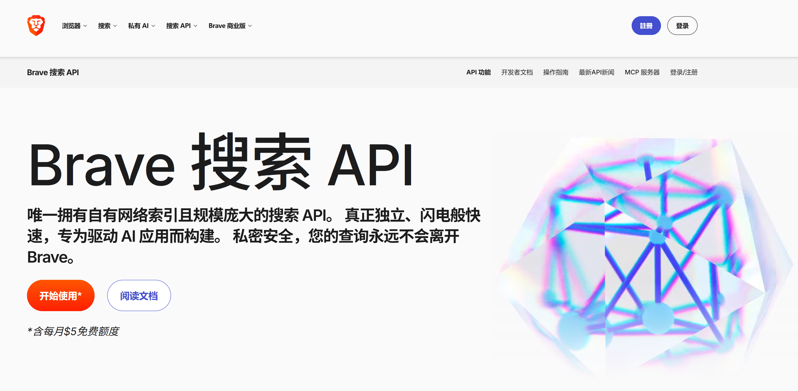
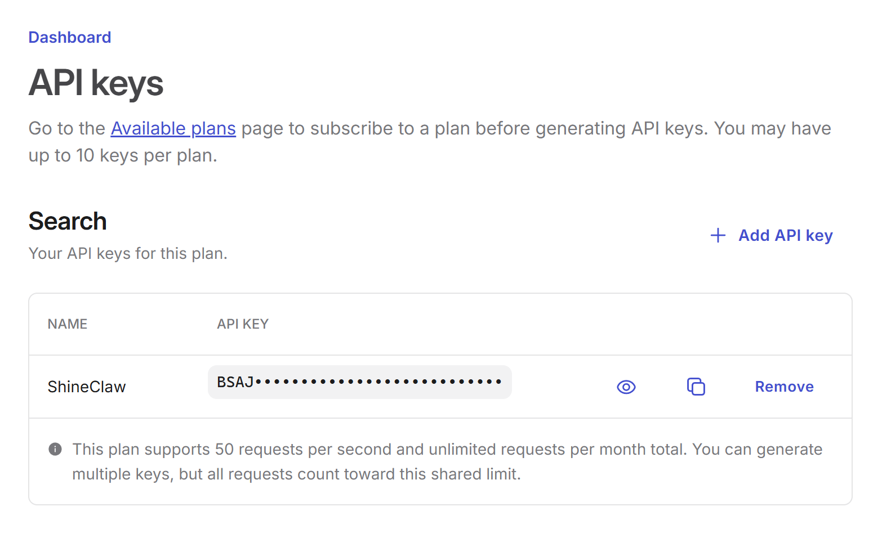
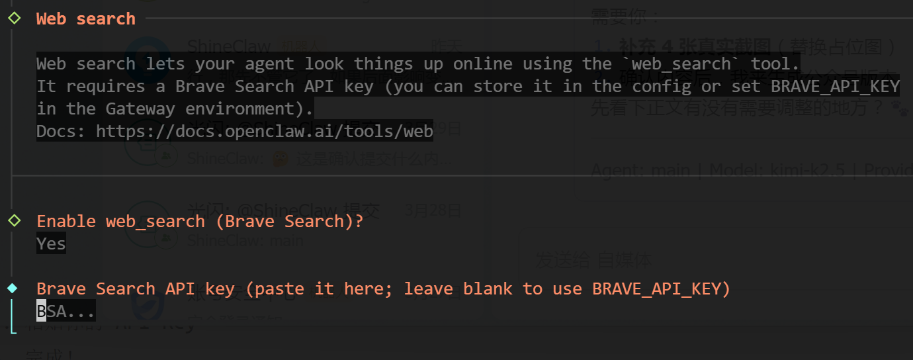
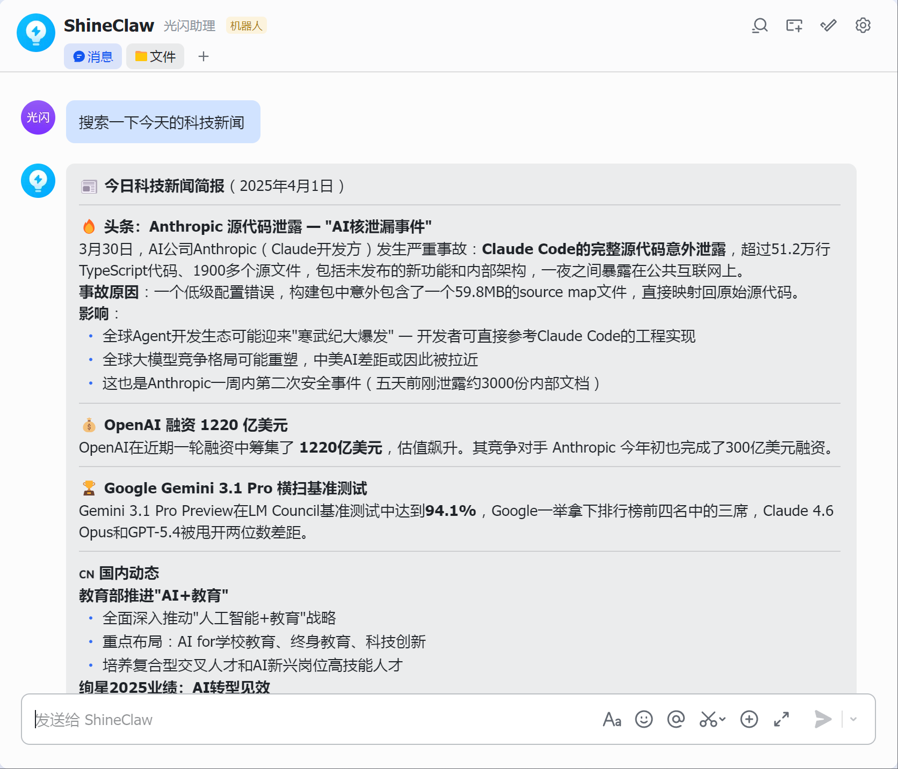
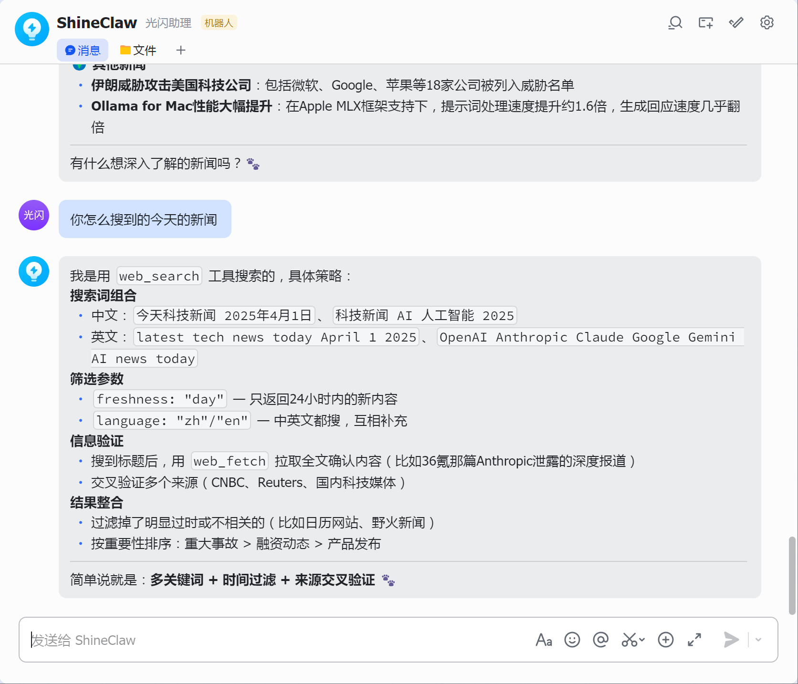

# 第3课：打破知识茧房——给它装上实时搜索能力


> **进度：3/12，这是让 AI 真正"与时俱进"的第一步。**

## 前言：为什么你的 AI 总是"活在半年前"？

想象一下这个场景：

你问 AI："昨天 OpenAI 发布了什么新功能？"
AI 回答："根据我的知识，OpenAI 最近一次重大更新是在 2024 年..."

**尴尬吧？**

大模型就像一个博览群书但闭门不出的学者——它读过无数书籍（训练数据），但**对昨天发生的事一无所知**。这是因为模型的知识有「截止日期」，通常是训练完成的时间点，距离现实往往有 6 个月到 1 年的差距。

**这堂课，我们要给 OpenClaw 装上"实时搜索"这双眼睛。**

配置完成后，你的 AI 就能：
- 🔍 搜索最新技术文档
- 📰 获取实时新闻资讯  
- 💰 查询当前股价/币价
- 🌤️ 了解今天天气（虽然下节课有专门的天气技能，但搜索也能做到）

而且好消息是：**完全免费**（每月 1000 次搜索额度，一般人根本用不完）。

---

## 准备工作

这节课你需要：
- ✅ 一个邮箱（用于注册 Brave 账号）
- ✅ 大约 10 分钟时间
- ✅ 已经安装好的 OpenClaw（前两课的内容）

**不需要：**
- ❌ 信用卡（Brave Search API 有免费额度）
- ❌ 代理/VPN（国内可直接访问）

---

## 第一步：注册 Brave Search 账号

Brave 就是那个做浏览器的公司，他们的搜索引擎以隐私保护著称。更棒的是，他们提供的 API 对开发者非常友好。

### 1.1 访问 Brave 官网

打开浏览器，访问：**https://brave.com/zh/search/api/**



*▲ 占位图：Brave 官网首页，点击右上角的 "Sign up" 按钮*

> **💡 小贴士**：如果你打不开 brave.com，也可以直接访问 **https://search.brave.com**，效果一样。

### 1.2 创建账号

点击 "Sign up" 后，你会看到注册页面：

1. 输入你的邮箱地址
2. 设置密码
3. 点击验证邮件里的链接
4. 完成！

整个过程和普通网站注册没区别，就不截图了（你肯定会的）。

---

## 第二步：获取 API Key

账号注册好后，我们需要获取 API Key——这是 OpenClaw 调用 Brave 搜索服务的"钥匙"。

### 2.1 进入 API 页面

访问：**https://api-dashboard.search.brave.com/app/keys**




*▲ 占位图：Brave Search API 页面，点击 "Add API key" 按钮*

### 2.2 生成 API Key

1. 登录你的 Brave 账号
2. 点击 "Add API key" 或类似的按钮
3. 复制生成的一串字符（看起来像这样：`BSAxxxxx...`）

**⚠️ 重要提示**：
- 这个 Key 只显示一次，**务必复制保存好**
- 如果丢失了，只能重新生成一个新的
- 不要把 Key 分享给他人，这是你的个人账户

---

## 第三步：配置 OpenClaw

现在我们有 API Key 了，接下来告诉 OpenClaw 怎么用它。

### 方式一：命令行配置（推荐，最简单）

打开终端，运行：

```bash
openclaw configure --section web
```



*▲ 占位图：终端中运行配置命令的界面*

按照提示一步步操作：
1. 选择启用 web 搜索：`yes`
2. 选择搜索提供商：`brave`
3. 粘贴你的 API Key
4. 完成！

OpenClaw 会自动修改配置文件，无需你手动编辑。

### 方式二：手动编辑配置文件

如果你喜欢"掌控感"，也可以直接改配置文件。

找到你的 `openclaw.json` 文件（通常在 `~/.openclaw/` 目录下），添加以下内容：

```json
{
  "tools": {
    "web": {
      "search": {
        "enabled": true,
        "provider": "brave",
        "apiKey": "BSAxxxxx..."
      }
    }
  }
}
```

**参数说明**：
- `enabled`: `true` 表示开启搜索功能
- `provider`: 搜索提供商，目前支持 `brave`（官方推荐）
- `apiKey`: 你刚才从 Brave 复制的 API Key

修改完成后，重启 OpenClaw 使配置生效：

```bash
openclaw restart
```

---

## 第四步：验证配置是否成功

配置好后，我们来测试一下。

### 测试对话

给你的 OpenClaw 发送消息：

> "搜索一下今天的科技新闻"

如果配置成功，你会看到 AI 返回实时搜索结果，类似这样：



*▲ 占位图：AI 返回实时搜索结果的对话截图（用户后续补充）*

### 如何判断是否成功？

✅ **成功标志**：
- AI 回复中包含了最新的信息
- 回复里有类似 "根据搜索结果..." 的表述
- 能看到具体的搜索结果摘要
- 直接问他怎么知道的



❌ **失败标志**：
- AI 说 "我没有搜索功能" 或类似的话
- 回复的知识明显过时（比如提到几个月前的事）
- 报错信息中包含 "api key" 或 "brave"

---

## 常见问题排查

### Q1: 配置完还是不搜索？

检查以下几点：

1. **OpenClaw 是否重启？** 修改配置后需要重启才能生效
2. **API Key 是否正确？** 检查是否有多余的空格或字符
3. **网络是否正常？** 尝试在浏览器访问 brave.com 看看能否打开

### Q2: 提示 "API key invalid"？

可能是以下原因：
- Key 复制不完整（漏了开头或结尾的字符）
- 使用了错误的 Key（Brave 可能有多个产品的 Key）
- Key 还没激活（刚注册的账号可能需要几分钟生效）

### Q3: 搜索额度用完了怎么办？

Brave 免费版每月 1000 次查询，对日常使用完全够用。如果不够：
- 检查是否真的需要这么多搜索（可能某些自动化脚本在滥用）
- 考虑升级到付费版（$3/月，10000 次查询）
- 或者等待下个月重置

### Q4: 可以用百度搜索吗？

可以！OpenClaw 支持通过 Skill 安装百度搜索引擎。访问 https://clawhub.com 搜索 "baidu" 技能即可。

不过 Brave 的搜索结果质量通常更好，而且免费额度充足，建议优先使用 Brave。

---

## 进阶玩法

### 限制搜索范围

如果你希望 AI 只在特定场景使用搜索，可以在配置中添加：

```json
{
  "tools": {
    "web": {
      "search": {
        "enabled": true,
        "provider": "brave",
        "apiKey": "BSAxxxxx...",
        "region": "CN",
        "language": "zh"
      }
    }
  }
}
```

这样搜索结果会优先显示中文内容。

### 与其他工具配合

搜索功能可以和 OpenClaw 的其他能力组合：

- **搜索 + 浏览器**：先搜索找到文章，再用浏览器工具深入阅读
- **搜索 + 记忆**：把搜索结果保存到长期记忆，供以后参考
- **搜索 + 定时任务**：每天早上自动搜索新闻摘要推送给你

这些进阶玩法我们会在「实战系列」中详细讲解。

---

## 小结

恭喜你！现在你的 OpenClaw 已经能"上网冲浪"了。

**这节课你学会了：**
- ✅ 为什么 AI 需要实时搜索能力
- ✅ 如何注册 Brave Search 并获取免费 API Key
- ✅ 两种配置方式：命令行 vs 手动编辑
- ✅ 如何验证配置是否成功
- ✅ 常见问题的排查方法

**进度更新：**
- 已完成：3/12 课
- 下节课预告：**第4课：睁眼看世界——多模态图片理解配置**

---

## 课后作业

试试看用这些 prompt 测试你的新能力：

1. "今天北京天气怎么样？"
2. "搜索一下 Python 3.13 的新特性"
3. "最近有什么好看的电影上映？"
4. "帮我查一下这个技术问题的最新解决方案：[你的问题]"

如果 AI 能给出准确、最新的回答，说明配置成功了！

---

*下节课，我们要让 OpenClaw 不仅能"读文字"，还能"看懂图片"。敬请期待！* 🐾
