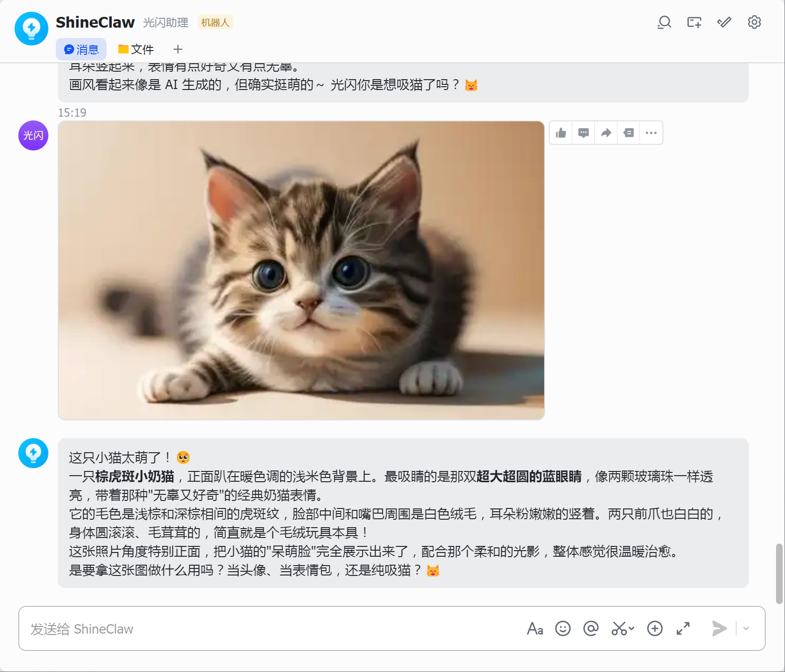

# 第4课：睁眼看世界——多模态图片理解配置


> **进度：4/12，这是让你的 AI 从"文字助手"升级为"视觉助手"的关键一步。**

## 前言：你的 AI 还是"瞎子"吗？

想象一下这些场景：

- 朋友发来一张风景照问你「这是哪里」，你只能回复「看不到图片，能描述一下吗？」
- 同事甩过来一张复杂图表让你分析，你只能让他把数据打出来
- 看到一张搞笑meme图，你想让 AI 解释笑点，它却说「我无法查看图片内容」

**尴尬吧？**

前几节课，我们给 OpenClaw 装上了大脑（模型配置）、嘴巴（飞书接入）、耳朵（实时搜索）。但它还缺一双**眼睛**——看懂图片的能力。

好消息是：**给 OpenClaw 开启图片理解，比你想的简单得多**。不需要安装额外软件，不需要复杂配置，只需要确认你的模型支持「多模态」即可。

这节课完成后，你的 AI 将能：
- 👁️ **识别图片内容**——「这张图里有几只猫？」
- 📊 **分析图表数据**——「这张柱状图显示了什么趋势？」
- 🖼️ **理解截图信息**——「这个报错是什么意思？」
- 📝 **提取文字信息**——「这张图里的文字内容是什么？」

**而且，这个功能是「原生支持」的**——OpenClaw 内置了图片理解能力，开箱即用。

---

## 准备工作

这节课你需要：
- ✅ 已经配置好的 OpenClaw（前三课的内容）
- ✅ 一个支持多模态的模型（大部分主流模型都支持）
- ✅ 一张测试图片（随手拍一张或用截图工具）
- ✅ 大约 5 分钟时间

**不需要：**
- ❌ 额外安装 skill
- ❌ 申请 API Key
- ❌ 复杂的配置调整

---

## 第一步：确认你的模型支持图片理解

在开始配置之前，先确认你当前使用的模型是否支持「多模态视觉理解」。

### 1.1 什么是多模态模型？

简单说：**能同时处理文字和图片的模型**。

在 OpenClaw 的模型配置中，通过 `input` 字段来标识模型支持哪些输入类型：
- `text` —— 只支持文字输入
- `image` —— 支持图片输入
- `text` + `image` —— 支持文字+图片混合输入（多模态）

**主流多模态模型举例：**

| 模型 | 提供商 | 是否支持图片 | 备注 |
|------|--------|-------------|------|
| GPT-4o | OpenAI | ✅ | 识图能力强 |
| Gemini 系列 | Google | ✅ | 识图+生图都支持 |
| Kimi K2.5 | Moonshot | ✅ | 国产多模态 |
| Qwen-3.5-plus | 阿里云 | ✅ | 中文场景友好 |
| Claude 3.5 | Anthropic | ✅ | 通过 OpenRouter 可用 |

**不确定你的模型是否支持？** 往下看，我会告诉你怎么查。

### 1.2 检查当前模型配置

打开你的 `openclaw.json` 配置文件，找到 `models.providers` 部分：

```json
{
  "models": {
    "providers": {
      "newapi": {
        "models": [
          {
            "id": "kimi-k2.5",
            "name": "Kimi K2.5",
            "input": ["text", "image"],  // ← 看这里！
            ...
          }
        ]
      }
    }
  }
}
```

**关键看点**：`input` 数组里有没有 `"image"`。

- 如果有 `"image"` → ✅ 恭喜你，你的模型已经支持图片理解，跳到「第三步：测试验证」
- 如果只有 `"text"` → 📝 继续看「第二步」，给模型加上图片能力

---

## 第二步：给模型加上「识图」能力

如果你的模型支持多模态但配置里没开，或者你想换一个支持识图的模型，跟着我操作。

### 2.1 方式一：修改现有模型配置（推荐）

假设你现在用的是 Kimi K2.5，但 `input` 里只有 `text`，我们来给它加上 `image`。

打开 `openclaw.json`，找到你的模型配置，在 `input` 数组里添加 `"image"`：

```json
{
  "models": {
    "mode": "merge",
    "providers": {
      "newapi": {
        "baseUrl": "https://your-api-endpoint.com",
        "apiKey": "your-api-key",
        "api": "openai-completions",
        "models": [
          {
            "id": "kimi-k2.5",
            "name": "Kimi K2.5",
            "reasoning": true,
            "input": [
              "text",
              "image"  // ← 添加这一行！
            ],
            "cost": {
              "input": 0,
              "output": 0,
              "cacheRead": 0,
              "cacheWrite": 0
            },
            "contextWindow": 200000,
            "maxTokens": 16384
          }
        ]
      }
    }
  }
}
```

**⚠️ 心理辅导**：别担心，加 `"image"` 不会额外收费。图片理解是按 token 计费的，和文字一样，只是输入变成图片了而已。

### 2.2 方式二：换一个新的多模态模型

如果你当前的模型真的不支持图片（比如一些纯文本的小模型），那就换一个吧。

以配置 Gemini 3.1 Flash 为例：

```json
{
  "models": {
    "mode": "merge",
    "providers": {
      "google": {
        "baseUrl": "https://your-gemini-endpoint.com",
        "apiKey": "your-gemini-key",
        "models": [
          {
            "id": "gemini-3.1-flash-preview",
            "name": "Gemini 3.1 Flash",
            "reasoning": true,
            "input": [
              "text",
              "image"
            ],
            "cost": {
              "input": 0,
              "output": 0,
              "cacheRead": 0,
              "cacheWrite": 0
            },
            "contextWindow": 1000000,
            "maxTokens": 8192
          }
        ]
      }
    }
  }
}
```

然后在 `agents.defaults.model` 里指定使用这个模型：

```json
{
  "agents": {
    "defaults": {
      "model": {
        "primary": "google/gemini-3.1-flash-preview"
      }
    }
  }
}
```

---

## 第三步（进阶）：为图片单独配置理解模型

**这是一个隐藏技巧，很多人不知道。**

假设你的主模型是个纯文本模型（比如某些便宜的专用模型），但你偶尔也想让它「看看」图片，怎么办？

OpenClaw 支持为图片**单独配置**一个理解模型，而不影响主对话模型！

### 3.1 配置 imageModel

在 `openclaw.json` 的 `agents` 部分，添加 `imageModel` 配置：

```json
{
  "agents": {
    "defaults": {
      "model": {
        "primary": "newapi/cheap-text-model"  // 主模型：便宜文本模型
      }
    },
    "imageModel": {
      "primary": "newapi/kimi-k2.5",  // 图片专用：多模态模型
      "fallbacks": [
        "newapi/qwen3.5-plus"  // 备选模型
      ]
    }
  }
}
```

**工作原理：**
- 正常对话 → 使用 `defaults.model` 配置的模型
- 发送图片 → 自动切换到 `imageModel` 配置的模型理解图片
- 理解完成后 → 结果返回给主模型继续对话

**适用场景：**
- 主模型用便宜的纯文本模型（省钱）
- 图片理解用专门的多模态模型（效果好）
- 两者无缝切换，用户无感知

---

## 第四步：重启并测试

配置完成后，**重启 OpenClaw** 使配置生效：

```bash
openclaw restart
```

### 4.1 测试方式一：直接发图片

在飞书群里，直接发送一张图片给 OpenClaw（不用打字）：




*▲ 占位图：在飞书中发送一张风景照/截图给机器人*

AI 应该会自动回复图片内容的描述，类似这样：

> 这张图展示了一座雪山，前景是绿色的草地和几棵松树，天空中有一些白云。看起来像是一个高山湖泊的景色，可能是在西藏或四川的某个景区。

### 4.2 测试方式二：图片+文字提问

发图片的同时配一段文字，测试更复杂的场景：

**你发送：** [一张包含数据的柱状图截图] + 文字「这张图显示了什么趋势？」

**AI 回复：**
> 从这张柱状图可以看出：
> - 2021 年到 2023 年，销售额呈逐年上升趋势
> - 2022 年增长率最高，约为 35%
> - 2023 年达到峰值 280 万，但增速放缓
> - 整体呈现稳健增长态势

### 4.3 测试方式三：图片转文字（OCR）

发一张包含文字的图片：

**你发送：** [一张手写笔记的照片]

**AI 回复：**
> 这张图片中的文字内容是：
> 
> "下周待办：
> 1. 完成 OpenClaw 第4课文章
> 2. 购买域名
> 3. 约小明吃饭"

---

## 常见问题 FAQ

### Q1: 为什么我的 AI 说「我无法查看图片」？

**排查步骤：**
1. 检查模型配置里的 `input` 是否包含 `"image"`
2. 检查 OpenClaw 是否重启过
3. 检查模型是否真的是多模态模型（有些模型名带 vision 才支持）

### Q2: 图片理解的费用怎么算？

**计费方式：** 大部分提供商按图片的「token 数量」计费，而不是按像素。

- 一般一张普通截图 ≈ 1000-2000 tokens
- 一张高清照片 ≈ 2000-4000 tokens
- 具体看提供商的计费标准

**省钱技巧：**
- 压缩图片分辨率（OpenClaw 会自动压缩）
- 不要用超高分辨率原图
- 对于纯文字图片，可以先 OCR 提取文字，再发文字提问

### Q3: 支持哪些图片格式？

OpenClaw 自动处理以下格式：
- ✅ PNG
- ✅ JPG/JPEG
- ✅ WEBP
- ✅ GIF（静态帧）

**文件大小限制：** 通常单张图片不超过 20MB，超过会自动压缩。

### Q4: 可以一次发多张图片吗？

**可以！** OpenClaw 支持一次上传多张图片，AI 会同时分析所有图片内容。

适用场景：对比两张图、分析前后变化、理解多步骤截图等。

### Q5: 我的模型支持识图，但效果不好怎么办？

**不同模型识图能力排名**（主观）：
1. GPT-4o / GPT-4 Turbo —— 最强，细节识别准确
2. Gemini 1.5 Pro —— 很强，长图、文档效果好
3. Claude 3.5 Sonnet —— 很强，文字识别准确
4. Kimi K2.5 / Qwen —— 不错，中文场景友好
5. Gemini Flash —— 够用，速度快

如果效果不好，尝试换更强的模型。

---

## 进阶技巧

### 技巧1：结合搜索使用

上节课我们配置了实时搜索，现在可以**图片 + 搜索**组合拳：

**你发送：** [一张陌生植物的图片]
**你提问：** 「这是什么植物？有毒吗？怎么养？」

AI 会：
1. 识别图片中的植物种类
2. 实时搜索该植物的详细信息
3. 给出养护建议

### 技巧2：截图分析代码报错

程序员福音：直接把报错截图发给 AI！

**你发送：** [IDE 报错截图]
**你提问：** 「这个报错是什么意思？怎么解决？」

AI 能识别截图中的代码和错误信息，给出针对性建议。

### 技巧3：图表数据提取

把 Excel 图表截图发给 AI，让它提取数据：

**你发送：** [柱状图/折线图截图]
**你提问：** 「把这张图里的数据整理成表格」

AI 会输出 Markdown 表格格式，直接复制可用。

---

## 总结：你现在拥有了什么？

🎉 **恭喜你，你的 OpenClaw 终于「睁眼看世界」了！**

回顾这 4 节课的成果：

| 课程 | 能力 | 状态 |
|------|------|------|
| 第1课 | 大脑（模型配置） | ✅ 能思考、能推理 |
| 第2课 | 嘴巴（飞书接入） | ✅ 能接收和发送消息 |
| 第3课 | 耳朵（实时搜索） | ✅ 能获取最新信息 |
| **第4课** | **眼睛（图片理解）** | **✅ 能看懂图片** |

**你的 AI 已经从「文字聊天机器人」升级为「多模态智能助手」**。

但这还只是开始。下节课，我们要让 AI 不仅能「看」，还能「画」——给它装上**图像生成**的能力！

---

## 课后作业

试试看用图片问 AI 这些问题：

1. 「这张截图里的报错是什么意思？」（程序员日常）
2. 「这张图是什么地方？值得去吗？」（旅行规划）
3. 「把这张图里的文字提取出来」（OCR 场景）
4. 「这两张图有什么区别？」（对比分析）

遇到问题随时在群里提问。

---

**下节预告：** 第5课《不只看得懂，还能画得出——文生图配置指南》，教你的 AI 从「看图说话」升级到「无中生有」，自己画图！

*进度：4/12 已完成 ✅*
