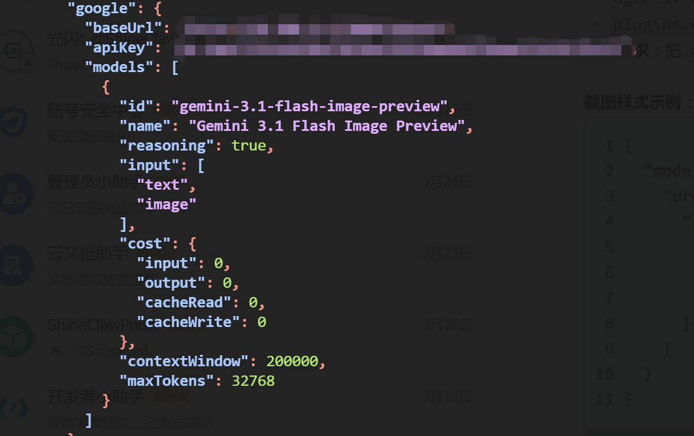
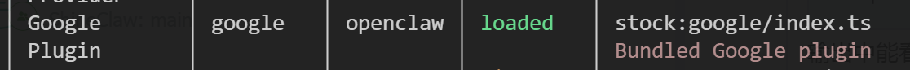
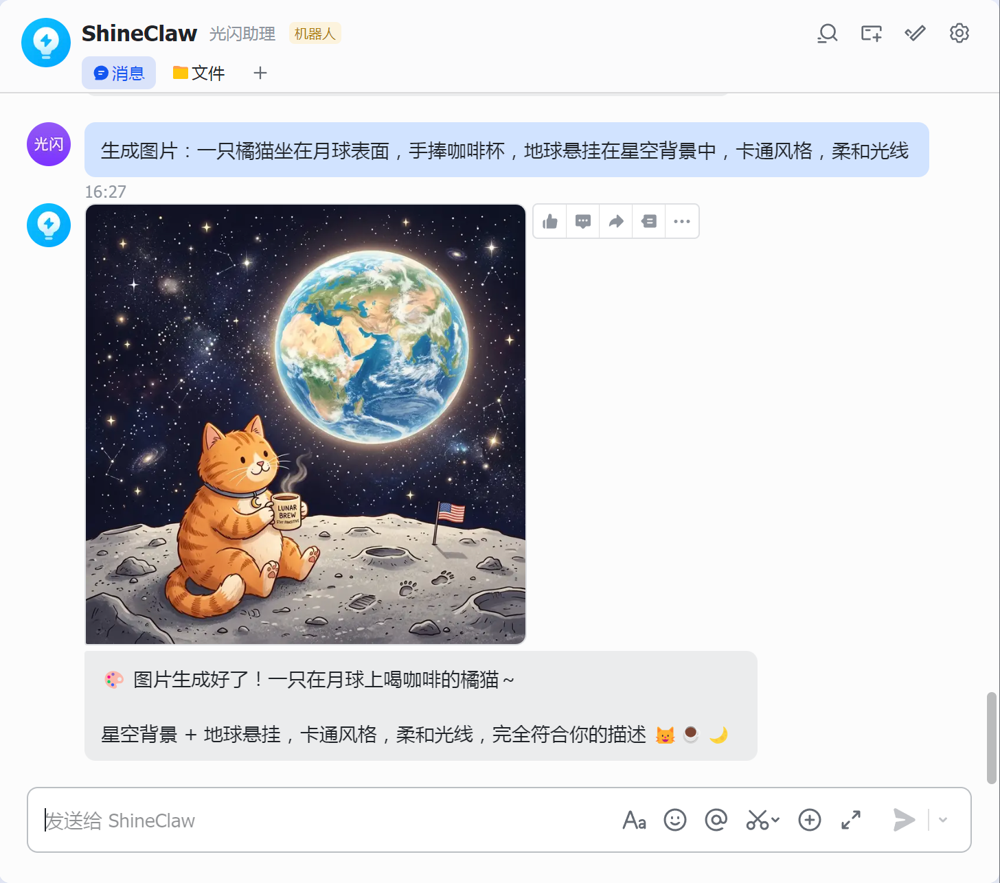

# 第5课：不只看得懂，还能画得出——文生图配置指南

> **进度：5/13，已解锁「AI绘画」能力**

你有没有过这种经历？想让AI帮你画个公众号封面图，结果它只能给你用文字描述"这是一张蓝色的背景图"；想让它根据你的草图生成成品，它却说"抱歉，我只能看懂不能画图"。

前4课，我们已经让OpenClaw装上了大脑、连上了嘴巴、学会了搜索、睁开了眼睛。今天这节课，我们要给它一双**会画画的手**。

好消息是：OpenClaw的文生图功能已经内置支持了，配置非常简单。坏消息是：如果你没按对步骤，它可能会跟你闹脾气（报错）。别担心，跟着这篇教程走，10分钟搞定。

---

## 先搞明白：OpenClaw怎么画图？

简单来说，OpenClaw本身不会画画，它是**调用专业的文生图模型**来帮你生成图片。目前支持两种主流方案：

| 方案 | 模型 | 特点 | 适合谁 |
|------|------|------|--------|
| **内置实现（推荐）** | Gemini/gpt-image-1 | 原生支持，配置简单 | 新手首选 |
| **Skill扩展** | nano-banana-pro / openai-image-gen | 功能更丰富，可批量生成 | 进阶玩家 |

**本节课重点讲内置实现**，因为这是2026.03新版OpenClaw的推荐方式，配置最省心。

---

## 第一步：确认你的OpenClaw版本

先检查一下你的OpenClaw是不是新版（2026.03.22之后）：

```bash
openclaw version
```

如果版本较旧，建议先升级：

```bash
openclaw update
```

**心理预防针**：新版重构了插件体系，很多功能都改成了插件化。如果你之前用过旧版的文生图，可能需要重新配置，别慌，新配置更简单。

---

## 第二步：配置文生图模型（核心步骤）

OpenClaw内置的文生图功能，需要两个条件同时满足：

1. **启用对应的图片生成插件**（google 或 openai）
2. **在对应Provider上配置文生图模型**



### 2.1 选择你的文生图引擎

目前支持两种内置引擎：

**方案A：Google Gemini（推荐，免费额度多）**
- 模型名：`gemini-3.1-flash-image-preview`
- 特点：速度快，支持图文混合生成
- 需要：Gemini API Key

**方案B：OpenAI gpt-image-1**
- 模型名：`gpt-image-1`
- 特点：画质更好，细节更丰富
- 需要：OpenAI API Key

两个方案配置流程几乎一样，下面以**Gemini方案**为例演示。

### 2.2 在Provider中配置模型

打开你的 `openclaw.json`，找到 `models.providers` 部分，添加 google provider：

```json
{
  "models": {
    "mode": "merge",
    "providers": {
      "google": {
        "baseUrl": "https://generativelanguage.googleapis.com",
        "apiKey": "你的Gemini API Key",
        "api": "google-generative",
        "models": [
          {
            "id": "gemini-3.1-flash-image-preview",
            "name": "Gemini 3.1 Flash Image",
            "reasoning": true,
            "input": ["text", "image"],
            "cost": {
              "input": 0,
              "output": 0,
              "cacheRead": 0,
              "cacheWrite": 0
            },
            "contextWindow": 128000,
            "maxTokens": 8192
          }
        ]
      }
    }
  }
}
```

**关键参数说明：**

- `baseUrl`: Gemini官方地址，如果你有中转站可以替换
- `apiKey`: 去 https://ai.google.dev/ 申请，免费版每月有额度
- `input`: 必须包含 `"image"`，表示支持图片相关功能
- `id`: 必须是 `gemini-3.1-flash-image-preview`（这个名称是固定的）

**⚠️ 注意**：`api` 字段要填 `"google-generative"`，不是 `"openai-completions"`，这是最容易踩的坑。

### 2.3 配置文生图专用模型

接下来，告诉OpenClaw用哪个模型来画图。在配置文件中添加：

```json
{
  "agents": {
    "imageGenerationModel": {
      "primary": "google/gemini-3.1-flash-image-preview"
    }
  }
}
```

这里的路径格式是 `provider名/模型id`，要和上一步配置的对应起来。

### 2.4 启用Google插件

**这一步是隐藏关卡，很多人漏掉这里导致功能不生效！**

在配置文件中添加：

```json
{
  "plugins": {
    "entries": {
      "google": {
        "enabled": true
      }
    }
  }
}
```

**为啥要这一步？**

OpenClaw在2026.03.22版本重构后，文生图功能由插件提供。默认虽然安装了google插件，但必须显式启用才会加载文生图能力。

---

## 第三步：重启OpenClaw，验证配置

保存配置文件后，重启OpenClaw让配置生效：

```bash
openclaw restart
```

重启后，先验证插件是否加载成功：

```bash
openclaw plugins list
```

你应该能看到 `google` 插件的状态是 `loaded`。



---

## 第四步：测试画图功能

现在OpenClaw应该已经学会画画了。我们来测试一下：

在飞书/微信/任何已配置的Channel里，给OpenClaw发送：

> "帮我画一只戴着墨镜的猫，赛博朋克风格，霓虹灯背景"

或者使用工具调用的方式：

```
生成图片：一只橘猫坐在月球表面，手捧咖啡杯，地球悬挂在星空背景中，卡通风格，柔和光线
```

**正常情况**，OpenClaw会回复一张图片，同时附带说明：




---

## 进阶：使用Skill方式（可选）

如果你需要更强大的文生图功能，比如批量生成、参考图重绘、特定风格控制，可以使用Skill扩展。

OpenClaw社区有两个主流文生图Skill：

### nano-banana-pro（Gemini增强版）

基于Gemini的图片生成，支持图片编辑功能。

```bash
# 安装skill
openclaw skills install nano-banana-pro
```

配置：

```json
{
  "skills": {
    "entries": {
      "nano-banana-pro": {
        "env": {
          "GEMINI_API_KEY": "你的API Key",
          "GEMINI_BASE_URL": "https://generativelanguage.googleapis.com"
        }
      }
    }
  }
}
```

### openai-image-gen（OpenAI DALL-E/GPT-Image）

支持OpenAI最新的gpt-image-1模型。

```bash
# 安装skill
openclaw skills install openai-image-gen
```

配置：

```json
{
  "skills": {
    "entries": {
      "openai-image-gen": {
        "env": {
          "OPENAI_API_KEY": "sk-你的Key",
          "OPENAI_BASE_URL": "https://api.openai.com/v1"
        }
      }
    }
  }
}
```

**两种方案的对比：**

| 功能 | 内置实现 | Skill扩展 |
|------|----------|-----------|
| 配置复杂度 | ⭐ 简单 | ⭐⭐⭐ 较复杂 |
| 单次生成 | ✅ 支持 | ✅ 支持 |
| 批量生成 | ❌ 不支持 | ✅ 支持 |
| 参考图编辑 | ❌ 不支持 | ✅ 支持 |
| 画廊展示 | ❌ 不支持 | ✅ 自动生成HTML画廊 |

如果你只是偶尔让AI画个图，**内置实现完全够用**。如果你是内容创作者需要批量生成，建议用Skill方案。

---

## 完整配置汇总

方便你复制粘贴的完整配置（替换 `YOUR_API_KEY` 为你的真实Key）：

```json
{
  "models": {
    "mode": "merge",
    "providers": {
      "google": {
        "baseUrl": "https://generativelanguage.googleapis.com",
        "apiKey": "YOUR_API_KEY",
        "api": "google-generative",
        "models": [
          {
            "id": "gemini-3.1-flash-image-preview",
            "name": "Gemini 3.1 Flash Image",
            "reasoning": true,
            "input": ["text", "image"],
            "cost": { "input": 0, "output": 0, "cacheRead": 0, "cacheWrite": 0 },
            "contextWindow": 128000,
            "maxTokens": 8192
          }
        ]
      }
    }
  },
  "agents": {
    "imageGenerationModel": {
      "primary": "google/gemini-3.1-flash-image-preview"
    }
  },
  "plugins": {
    "entries": {
      "google": {
        "enabled": true
      }
    }
  }
}
```

---

## 常见问题排查

### ❓ 发送画图指令后，OpenClaw说"我没有画图能力"

**原因**：插件未启用或模型未配置正确。

**排查步骤**：

1. 检查 `plugins.entries.google.enabled` 是否为 `true`
2. 检查 `models.providers.google.models` 中是否有 `gemini-3.1-flash-image-preview`
3. 检查 `agents.imageGenerationModel.primary` 是否指向正确的模型路径
4. 重启OpenClaw

### ❓ 报"Google API key missing"错误

**原因**：API Key未正确配置或环境变量未生效。

**解决**：确保 `models.providers.google.apiKey` 已填写，且不是空字符串。

### ❓ 生成的图片质量很差/不像描述的那样

**原因**：提示词（prompt）需要优化。

**建议**：
- 用英文描述效果更好（模型对英文理解更准）
- 加上风格关键词："digital art", "photorealistic", "anime style", "oil painting"
- 指定画质："high quality", "4k", "detailed"

### ❓ 画图很慢，经常超时

**原因**：文生图本身需要时间，Gemini通常3-10秒，复杂图片可能更久。

**解决**：耐心等待，或降低图片复杂度要求。如果总是超时，检查网络连接。

---

## 恭喜你！又解锁了一项超能力

到这里，你已经完成了：

✅ 配置了文生图模型  
✅ 启用了图片生成插件  
✅ 测试并验证功能正常  

**进度更新：5/13**

下一节课，我们要让OpenClaw**开口说话**——配置TTS语音回复。想象一下，在飞书里收到AI发来的语音消息，是不是有点酷？

*本文档由 AI 辅助生成，如有错误欢迎指正。*
