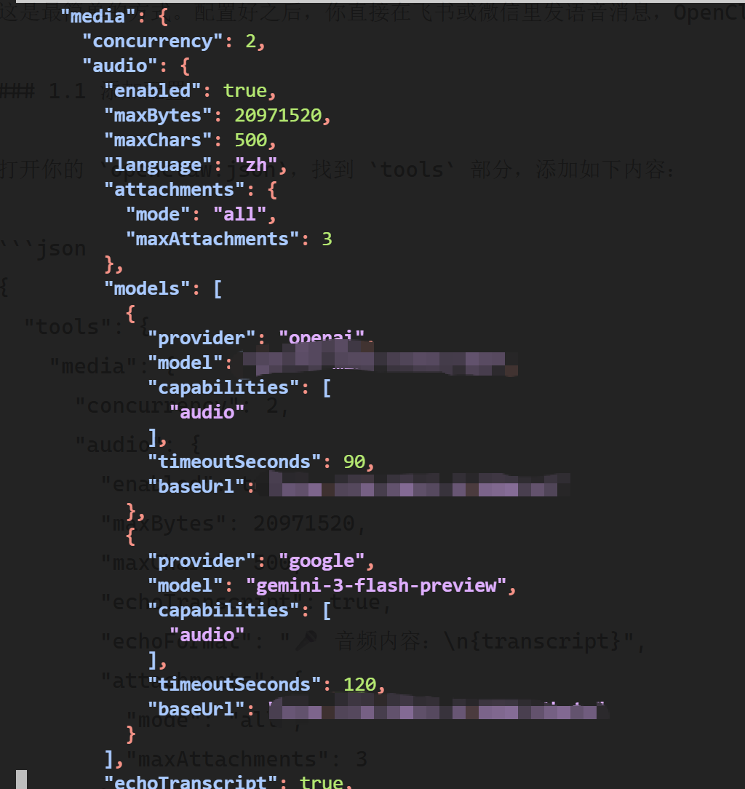
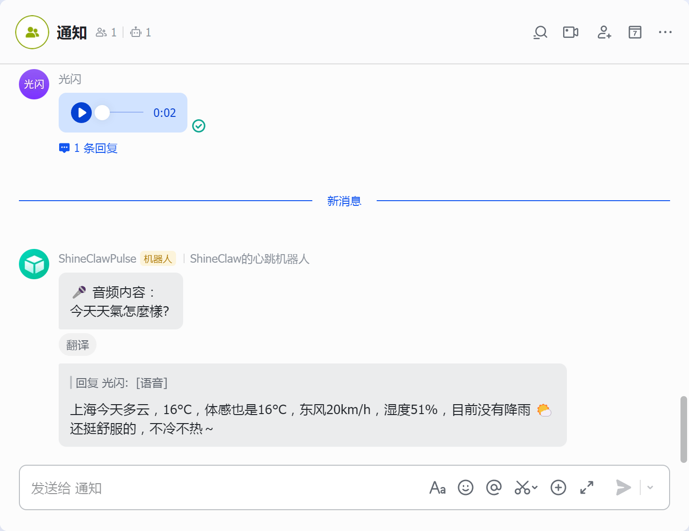

# 第7课：让他听懂说话——语音消息识别配置

> **进度：7/12，你的AI即将「听懂人话」**

前几节课，我们给 OpenClaw 装上了大脑、连上了频道、学会了搜索、睁开了眼睛、学会了画画、甚至还能开口说话。但有个问题还没解决——**它只能「说」，还不能「听」**。

想象一下这个场景：你在开车，双手离不开方向盘，这时候想查个东西，打字不方便，于是你对着手机发了条语音。结果 OpenClaw 回了一句：「我看不到语音消息，请发文字。」

...这体验就很割裂。

好消息是，**语音识别（STT）的配置比 TTS 还简单**。只要几分钟，你就能对着 OpenClaw 发语音消息，它会自动转录成文字，然后用文字（或者语音！）回复你。

这节课完成后，你的 AI 将能：
- 🎤 **自动识别语音消息**——收到语音自动转文字
- 📝 **转录音频文件**——MP3、WAV 等文件直接转文字
- 🗣️ **实现语音对话**——结合上节课的 TTS，做到「你说语音，它回语音」

---

## 准备工作

这节课你需要：
- ✅ 已经配置好的 OpenClaw（前6课的内容）
- ✅ 上节课的 TTS 配置（这节课会用到）
- ✅ 大约 10 分钟时间
- ✅ 一个能发语音消息的设备（手机/电脑）

**不需要：**
- ❌ 申请新的 API Key（用之前的 provider 即可）
- ❌ 额外安装 skill（内置支持就够用了）
- ❌ 复杂的配置调整

---

## 先搞明白：语音识别是怎么工作的？

简单来说，OpenClaw 收到语音后，会经历这样一个流程：

```
你发送语音 → OpenClaw 提取音频 → STT 模型转文字 → 文字喂给 AI → AI 生成回复
```

**STT（Speech-to-Text）** 就是「语音转文字」的技术。OpenClaw 收到语音文件后，会调用 STT 模型把音频转成文字，剩下的就和普通文字对话一样了。

目前 OpenClaw 支持两种方式：

想想看，你和朋友聊天，是打字多还是发语音多？特别是忙的时候、走路的时候、躺着的时候——语音才是更自然的方式。可我们的 OpenClaw 现在还只能"看"文字，你发一段语音过去，它一脸懵。

这节课，我们就来解决这个问题。**给 OpenClaw 装上"耳朵"，让它能听懂你说话。**

好消息是，配置语音识别的复杂度比 TTS 还低。只要几分钟，你就能对着 OpenClaw 发语音消息了。

---

## 本节目标

读完本文，你将能够：
- ✅ 让 OpenClaw 自动识别聊天软件里的语音消息
- ✅ 发送音频文件让它转录文字
- ✅ 了解内置支持和 Skill 方案的区别，按需选择

**预估时间**：10 分钟  
**难度**：⭐⭐（比 TTS 还简单）

---

## 先搞清楚一件事：语音识别怎么工作？

在动手之前，先花 30 秒理解一下原理，后面配置更明白。

简单来说，OpenClaw 收到语音后，会：
1. **提取音频数据**（从飞书/微信消息里把语音文件拿出来）
2. **送给 STT 模型**（Speech-to-Text，语音转文字）
3. **把文字喂给 AI**（剩下的就和普通对话一样了）

所以核心就是：**配一个能把语音转成文字的模型**。

目前 OpenClaw 支持两种方式：

| 方式 | 适用场景 | 特点 |
|------|----------|------|
| **内置支持** | 聊天软件里发语音消息 | 自动识别，无需额外指令 |
| **Skill 方案** | 发送音频文件、批量转录 | 需要手动调用，但功能更灵活 |

**我的建议**：先配好内置支持，90% 的场景都够用了。真有转录音频文件的需求，再装 Skill。

---

## 第一步：配置内置语音识别（推荐）

这是最简单的方式。配置好之后，你直接在飞书或微信里发语音消息，OpenClaw 会自动转录并回复你。

### 1.1 添加配置

打开你的 `openclaw.json`，找到 `tools` 部分，添加如下内容：

```json
{
  "tools": {
    "media": {
      "concurrency": 2,
      "audio": {
        "enabled": true,
        "maxBytes": 20971520,
        "maxChars": 500,
        "echoTranscript": true,
        "echoFormat": "🎤 音频内容：\n{transcript}",
        "attachments": {
          "mode": "all",
          "maxAttachments": 3
        },
        "language": "zh",
        "models": [
          {
            "provider": "openai",
            "model": "gpt-4o-mini-transcribe",
            "capabilities": ["audio"],
            "baseUrl": "https://你的中转站地址/v1",
            "timeoutSeconds": 90
          },
          {
            "provider": "google",
            "model": "gemini-3-flash-preview",
            "capabilities": ["audio"],
            "baseUrl": "https://你的中转站地址/v1beta",
            "timeoutSeconds": 120
          }
        ]
      }
    }
  }
}
```

**参数解释**（挑几个重要的说）：

| 参数 | 作用 | 建议值 |
|------|------|--------|
| `enabled` | 开关，设为 `true` 才启用 | `true` |
| `maxBytes` | 最大支持 20MB 的语音文件 | `20971520`（20MB） |
| `echoTranscript` | 是否在回复里显示转录的文字 | `true`（方便确认） |
| `echoFormat` | 转录文字的显示格式 | 自定义，带个 🎤 emoji 挺直观 |
| `language` | 默认语言，`zh` 表示中文 | `zh` |

**关于模型选择**：
- `gpt-4o-mini-transcribe`：OpenAI 的轻量级转录模型，快且准
- `gemini-3-flash-preview`：Google 的模型，支持更长音频

你可以两个都配，OpenClaw 会按顺序尝试。如果第一个失败，自动用第二个。




### 1.2 配置 Provider

等等，还没完。

上面的配置里，我们用了 `provider: "openai"` 和 `provider: "google"`。但 OpenClaw 怎么知道这些 provider 的 API 地址和密钥呢？

**你需要在 `models.providers` 里补充这两个 provider 的配置**：

```json
{
  "models": {
    "mode": "merge",
    "providers": {
      "openai": {
        "baseUrl": "https://你的中转站地址/v1",
        "apiKey": "sk-你的API密钥",
        "models": []
      },
      "google": {
        "baseUrl": "https://你的中转站地址/v1beta",
        "apiKey": "sk-你的API密钥",
        "models": []
      },
      "moonshot": {
        "baseUrl": "https://你的中转站地址/v1",
        "apiKey": "sk-你的API密钥",
        "models": []
      }
    }
  }
}
```

**注意几点**：
- `models` 数组留空就行，语音识别不依赖这里的模型列表
- `baseUrl` 和 `apiKey` 填你自己的中转站信息

### 1.3 重启并测试

保存配置，重启 OpenClaw：

```bash
openclaw restart
```

然后打开飞书或微信，给你的 OpenClaw 发一段语音：

**你发**：「今天天气怎么样」

**它回**：
```
🎤 音频内容：今天天气怎么样

上海今天多云，16°C，体感也是16°C，东风20km/h，湿度51%，目前没有降雨 🌤️
还挺舒服的，不冷不热～
```

看到那个 🎤 开头的转录内容，就说明成功了！



---

## 第二步：结合 TTS 实现「语音对话」（进阶）

**这是这节课最爽的部分。**

上节课我们配置了 TTS（语音回复），这节课配置了 STT（语音识别）。如果把两者结合起来，你就能实现：**发语音问问题，AI 用语音回复你**。

想象一下：你躺在床上，闭着眼睛，用语音和 AI 聊天。这体验是不是很像科幻电影里的 AI 助手？

### 2.1 修改 TTS 配置

要实现这个功能，需要修改上节课的 TTS 配置。打开 `openclaw.json`，找到 `messages.tts` 部分，把 `auto` 参数改成 `inbound`：

```json
{
  "messages": {
    "tts": {
      "auto": "inbound",
      "provider": "edge",
      "edge": {
        "enabled": true,
        "voice": "zh-CN-XiaoxiaoNeural",
        "lang": "zh-CN"
      }
    }
  }
}
```

**参数说明：**
- `auto: "inbound"` —— **关键设置**：仅当用户发送语音消息进来时，AI 才用语音回复

这样一来，**你发文字，AI 回文字；你发语音，AI 回语音**——完美匹配！

### 2.2 测试语音对话

重启 OpenClaw 后，测试一下：

**你发语音**：「讲一个 2 分钟的睡前故事」

**AI 回**：
- 📝 文字版：故事内容...
- 🎙️ 语音版：温柔的声音把故事读给你听

**使用建议：**
- 适合场景：睡前故事、通勤听新闻、做饭时查菜谱
- 省流量技巧：如果流量有限，可以只在 WiFi 下开启 TTS
- 快速切换：发送 `/tts on` 或 `/tts off` 可以随时开关语音回复

---

## 第三步：用 Skill 转录音频文件（可选）

内置支持已经很香了，但有些场景它覆盖不到：
- 你想发一个 MP3 文件让它转文字
- 你想批量处理多个音频文件
- 你想对转录结果做二次处理（比如总结、翻译）

这时候就需要 **openai-whisper-api** Skill 出场了。

### 3.1 安装 Skill

这个 Skill 是 OpenClaw 内置的，直接用就行。但如果你的中转站不是官方 OpenAI API，**建议用我改写的版本**，支持自定义 `baseUrl`。

**下载地址**：https://github.com/HikariShine/AgentStudy/tree/main/skills/openai-whisper-api

下载后放到 `~/.openclaw/skills/openai-whisper-api/` 目录下，然后添加配置：

```json
{
  "skills": {
    "entries": {
      "openai-whisper-api": {
        "env": {
          "OPENAI_API_KEY": "sk-你的API密钥",
          "OPENAI_BASE_URL": "https://你的中转站地址/v1"
        }
      }
    }
  }
}
```

重启 OpenClaw 生效。

### 3.2 使用方式

配置好之后，你可以直接说：

> "帮我把这个音频转录成文字"（同时上传音频文件）

或者更具体一点：

> "转录这个 MP3 文件，用中文输出"

OpenClaw 会调用 Whisper API，把音频转成文字给你。

**和内置支持的区别**：
- 内置支持：收到语音**自动**转录，无缝体验
- Skill：需要你**主动要求**，但支持任意音频文件

---

## 常见问题 FAQ

### Q1: 发了语音，OpenClaw 没反应？

**排查步骤：**
1. 确认已重启 OpenClaw
2. 检查 `tools.media.audio.enabled` 是否为 `true`
3. 检查 `models.providers` 里的 `baseUrl` 和 `apiKey` 是否正确
4. 查看日志：`openclaw logs`，搜关键词 "audio" 或 "transcribe"

### Q2: 转录出来的文字是英文？

**解决**：
- 检查 `language` 配置是否为 `zh`
- 或在消息里明确说「用中文转录」
- 有些模型（如 Gemini）对多语言混合识别更好

### Q3: 转录速度很慢？

**原因**：音频太长或网络延迟。

**优化**：
- 短语音（30 秒内）用 `gpt-4o-mini-transcribe`，速度快
- 长音频用 `gemini-3-flash-preview`，支持更长上下文
- 检查你的中转站网络质量

### Q4: 语音文件太大传不上去？

语音消息一般有平台限制：
- 飞书：单条语音最大 25MB
- 微信：单条语音最大 25MB
- OpenClaw 默认限制 20MB（可通过 `maxBytes` 调整）

如果超出限制，建议压缩或分段发送。

### Q5: 能和 TTS 同时开启吗？

**可以！** 这就是第二节讲的「语音对话」功能。STT 和 TTS 完全独立，可以同时配置。

### Q6: 支持哪些音频格式？

OpenClaw 会自动处理常见格式（MP3、WAV、M4A、OGG 等），你不用操心。

---

## 进阶技巧

### 技巧1：用语音做「会议纪要」

录了一段会议音频，让 OpenClaw 转录并总结：

**你发送**：「转录这个音频，总结成 3 个要点」+ [上传音频文件]

### 技巧2：语音 + 搜索联动

不方便打字时，用语音查资料：

**你发语音**：「查一下今天的科技新闻」

**AI 回**：语音播报今天的重要科技新闻

### 技巧3：语音 + 图片理解

看到有意思的东西，拍照 + 语音提问：

**你发**：「[图片] 这是什么？多少钱能买到？」

**AI 回**：识别图片内容 + 语音回复

### 技巧4：多语言语音识别

如果你经常和外文打交道，可以用 Gemini 模型，它对多语言混合识别更好：

```json
{
  "provider": "google",
  "model": "gemini-3-flash-preview",
  "language": "auto"
}
```

---

## 总结：你现在拥有了什么？

🎉 **恭喜你，你的 OpenClaw 能「听懂人话」了！**

回顾这 7 节课的成果：

| 课程 | 能力 | 状态 |
|------|------|------|
| 第1课 | 大脑（模型配置） | ✅ 能思考、能推理 |
| 第2课 | 嘴巴（飞书接入） | ✅ 能接收和发送消息 |
| 第3课 | 耳朵（实时搜索） | ✅ 能获取最新信息 |
| 第4课 | 眼睛（图片理解） | ✅ 能看懂图片 |
| 第5课 | 双手（文生图） | ✅ 能生成图片 |
| 第6课 | 嗓子（语音回复） | ✅ 能开口说话 |
| **第7课** | **耳朵（语音识别）** | **✅ 能听懂语音** |

**现在你的 AI 已经具备了「全双工语音能力」**：
- 🗣️ 你说语音，它听得懂（STT）
- 🎙️ 它用语音回复你（TTS）

**这不再是「聊天机器人」，而是真正的「语音助手」**。

但这还不是终点。下节课，我们要更进一步——让 AI 能「看懂视频」。想象一下，丢一个 B 站链接过去，它直接帮你总结视频内容...

---

## 课后作业

试试这些语音玩法：

1. **纯语音对话**：用语音问「讲一个 2 分钟的睡前故事」，享受语音回复
2. **语音 + 搜索**：用语音问「查一下今天的天气和新闻」
3. **语音 + 生图**：用语音描述「画一只穿着宇航服的猫」

遇到问题随时在群里提问。

---

**下节预告：** 第8课《看视频不用自己看——AI 视频分析能力配置》，教你的 AI 从「能听会说」升级到「能看懂视频」，实现真正的「视频助手」！

*进度：7/12 已完成 ✅*

---

*文章作者：光闪*  
*系列：OpenClaw 搭建与配置*  
*发布日期：2026-04-07*
