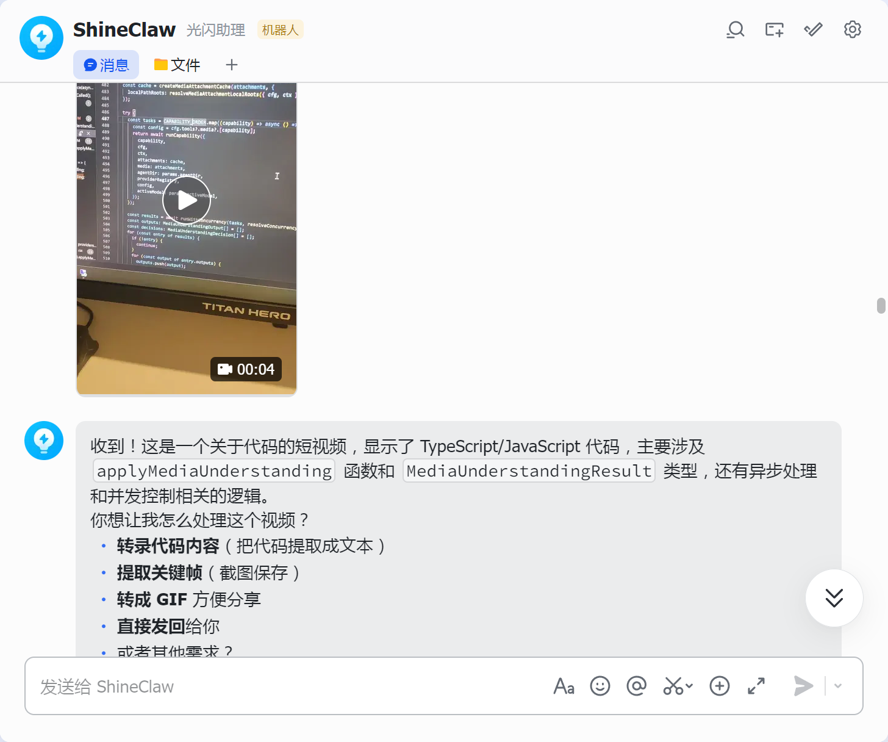
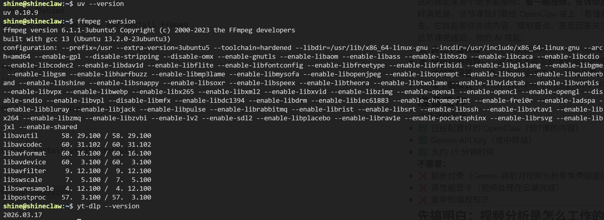
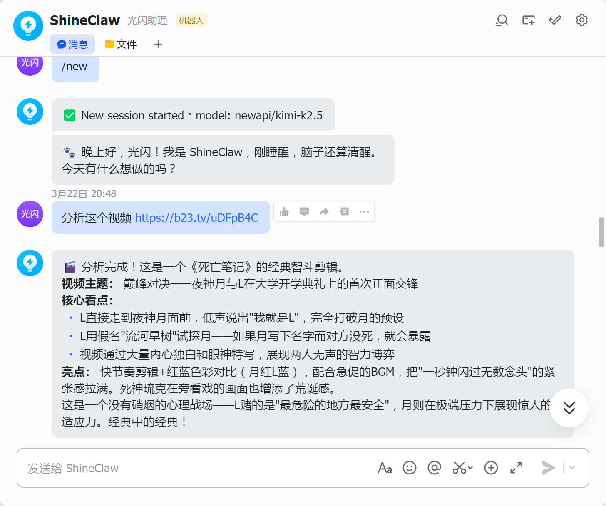

# 第8课：让他看懂视频——AI视频分析能力配置

> **进度：8/12，你的AI即将「看懂视频」**

想象一下这样的场景：

朋友发来一个视频网站链接，标题写着「必看！这个视频改变了我的人生」。你点进去一看，30分钟。你心想："这得看到什么时候？" 

或者你在刷YouTube，看到一个技术分享视频，想知道适不适合自己现在的水平，但又不想花20分钟看完才发现——"哦，原来讲的是这个，我早就会了。"

这时候如果有个助手能帮你：**看一眼视频，告诉你里面讲了啥，值不值得看**——是不是很香？

好消息是，这节课我们要给 OpenClaw 装上「看懂视频」的能力。配置好之后，你只需要丢一个视频链接过去，它就能帮你总结内容、提取要点、甚至回答关于视频的具体问题。

这节课完成后，你的 AI 将能：
- 🎬 **自动下载视频**——支持视频网站、YouTube等1000+网站
- 👁️ **分析视频内容**——用多模态模型看懂画面和听懂声音
- 💬 **总结和问答**——告诉你视频讲了啥，回答你的具体问题
- ⚡ **零下载模式**——YouTube视频可以直接分析，不用等下载

---

## 准备工作

这节课你需要：
- ✅ 已经配置好的 OpenClaw（前7课的内容）
- ✅ Gemini API Key（或中转站）
- ✅ 大约 15 分钟时间

**不需要：**
- ❌ 额外付费（Gemini 目前对视频分析有免费额度）
- ❌ 高性能显卡（视频处理在云端完成）
- ❌ 复杂的编程知识

---

## 先搞明白：视频分析是怎么工作的？

OpenClaw 提供**两种方式**来理解视频：

| 方式 | 适用场景 | 特点 |
|------|----------|------|
| **内置支持** | 聊天中直接上传短视频 | 无需安装 Skill，自动识别，但有大小限制 |
| **Skill 方案** | 发送视频链接分析 | 支持长视频、YouTube零下载模式 |

简单来说，视频分析的流程是：

```
你发送视频 → 多模态模型分析 → 返回结果
```

这里有几个关键点：

**1. 内置支持（tools.media.video）**
- 配置简单，开箱即用
- 直接在聊天窗口上传视频文件即可分析
- 限制：Gemini 最大 14MB，Kimi 最大 7MB

**2. 视频下载（yt-dlp - Skill 方案）**
- 发送视频链接，自动下载后分析
- 支持1000+视频网站
- 智能压缩，支持更长的视频

**3. 视频分析模型**
- Gemini 可以直接「看」视频，理解画面和声音
- 支持直接分析 YouTube 链接（不用下载！）

---

## 第一步：配置内置支持（推荐）

这是最简单的方式，配置好之后，你直接在聊天窗口上传视频文件，OpenClaw 就会自动分析。

### 1.1 添加配置

打开你的 `openclaw.json`，添加 `tools.media.video` 配置：

```json
{
  "tools": {
    "media": {
      "concurrency": 2,
      "video": {
        "enabled": true,
        "maxBytes": 52428800,
        "maxChars": 800,
        "attachments": {
          "mode": "first",
          "maxAttachments": 1
        },
        "models": [
          {
            "provider": "google",
            "model": "gemini-3-flash-preview",
            "capabilities": ["video"],
            "baseUrl": "https://你的中转站地址/v1beta",
            "timeoutSeconds": 180
          },
          {
            "provider": "moonshot",
            "model": "kimi-k2.5",
            "capabilities": ["video"],
            "baseUrl": "https://你的中转站地址/v1",
            "timeoutSeconds": 150
          }
        ]
      }
    }
  }
}
```

**参数解释：**

| 参数 | 说明 | 建议值 |
|------|------|--------|
| `enabled` | 开关 | `true` |
| `maxBytes` | 最大支持 50MB 的视频文件 | `52428800`（50MB） |
| `maxChars` | 转录结果最大字符数 | `800` |
| `models` | 分析模型列表 | 按顺序尝试 |

**关于模型选择：**
- `gemini-3-flash-preview`：Google 的轻量级模型，支持 14MB 以内视频
- `kimi-k2.5`：Moonshot 的模型，支持 7MB 以内视频

你可以两个都配，OpenClaw 会按顺序尝试。

### 1.2 配置 Provider

上面的配置用了 `provider: "google"` 和 `provider: "moonshot"`，你需要在 `models.providers` 里补充这两个 provider：

```json
{
  "models": {
    "mode": "merge",
    "providers": {
      "google": {
        "baseUrl": "https://你的中转站地址/v1beta",
        "apiKey": "你的API密钥",
        "models": []
      },
      "moonshot": {
        "baseUrl": "https://你的中转站地址/v1",
        "apiKey": "你的API密钥",
        "models": []
      }
    }
  }
}
```

**注意**：`models` 数组留空即可，视频分析不依赖这里的模型列表。

### 1.3 重启并测试

保存配置，重启 OpenClaw：

```bash
openclaw gateway restart
```

然后打开飞书或微信，直接上传一个短视频（建议 20MB 以内）：

**你发送**：上传视频文件 + 「帮我看看这个视频讲了什么」

**AI 回复**：
```
🎬 视频分析完成

**内容总结：**
这个视频主要讲了...（要点1、要点2、要点3）
```



---

## 第二步：安装依赖（Skill 方案）

如果你需要分析**视频链接**（而不是直接上传文件），或者视频**超过 20MB**，就需要使用 Skill 方案。

这节课需要安装几个工具，别慌，都是一键安装。

### 2.1 安装 uv（Python 包管理器）

```bash
# macOS
brew install uv

# Linux
curl -LsSf https://astral.sh/uv/install.sh | sh
```

验证安装：
```bash
uv --version
```

### 2.2 安装 FFmpeg（视频处理工具）

```bash
# macOS
brew install ffmpeg

# Ubuntu/Debian
sudo apt update && sudo apt install ffmpeg

# 验证
ffmpeg -version
```

### 2.3 安装 yt-dlp（视频下载器）

```bash
uv tool install yt-dlp[default]

# 验证
yt-dlp --version
```



---

## 第三步：安装 Skill

### 3.1 下载 Skill 文件

这个 Skill 需要手动安装。从仓库下载：

```bash
git clone https://github.com/HikariShine/AgentStudy.git
cp -r AgentStudy/skills/video-downloader-analyzer ~/.openclaw/skills/
```

或者直接下载压缩包解压到 `~/.openclaw/skills/video-downloader-analyzer/`。

### 3.2 配置环境变量

打开你的 `openclaw.json`，添加 Skill 配置：

```json
{
  "skills": {
    "entries": {
      "video-downloader-analyzer": {
        "env": {
          "GEMINI_API_KEY": "你的Gemini API Key",
          "GEMINI_BASE_URL": "https://你的中转站地址/v1beta"
        }
      }
    }
  }
}
```

**参数说明：**

| 参数 | 说明 | 示例 |
|------|------|------|
| `GEMINI_API_KEY` | Gemini API 密钥 | `AIzaSy...` 或中转站密钥 |
| `GEMINI_BASE_URL` | API 地址（可选） | 官方或中转站地址 |

**注意：**
- 如果用官方 Gemini API，`GEMINI_BASE_URL` 可以省略
- 如果用中转站，两个都要填

### 3.3 重启 OpenClaw

```bash
openclaw gateway restart
```

---

## 第四步：测试 Skill 视频分析

现在来测试一下效果！

### 4.1 分析视频网站视频（推荐）

视频网站视频需要先下载再分析：

**你发送：**
```
总结一下这个视频：https://www.example.com/video/xxxxx
```

AI 会自动：
1. 下载视频（360p，文件小）
2. 分析内容
3. 返回总结
4. （可选）删除临时文件




### 4.2 分析 YouTube 视频

YouTube 视频有个超爽的功能：**不用下载，直接分析**。

**你发送：**
```
分析一下这个视频：https://www.youtube.com/watch?v=xxxxx
```

**AI 回复：**
> 🎬 视频分析完成
> 
> **视频标题：** xxx
> **时长：** 15:30
> 
> **内容总结：**
> 这个视频主要讲了...（要点1、要点2、要点3）
> 
> **值得看吗？**
> 值得/一般/不推荐，因为...

### 4.3 分析本地视频文件

如果你有本地的 MP4 文件，也可以直接上传分析：

**你发送：**
```
帮我看看这个视频讲了什么[上传文件]
```

或者：
```
分析这个视频的重点内容：/path/to/video.mp4
```

---

## 进阶用法

### 5.1 指定分析重点

不要只让AI总结，你可以指定关注点：

| 你的提问 | AI 会关注 |
|---------|----------|
| "总结一下这个视频" | 整体内容和要点 |
| "这个视频适合初学者吗？" | 难度评估和学习建议 |
| "视频里的代码能跑吗？" | 技术细节和可行性 |
| "作者的观点是什么？" | 主观观点和论证 |
| "视频里推荐了哪些工具？" | 具体产品和链接 |

### 5.2 追问细节

第一次分析后，你可以继续问：

**你：** "刚才那个视频，第5分钟提到的那个工具叫什么名字？"

**AI：** "根据视频内容，第5分钟左右作者提到的工具是 xxx，它是一个..."

### 5.3 结合其他功能

视频分析可以和其他能力组合：

**视频 + 搜索：**
> "分析这个视频，然后查一下里面提到的技术最新进展"

**视频 + 生图：**
> "总结这个视频，然后画一张封面图"

**视频 + TTS：**
> "把这个视频的内容读给我听"（配合第6课的TTS）

---

## 常见问题 FAQ

### Q1: 内置支持和 Skill 方案有什么区别？

| 对比项 | 内置支持 | Skill 方案 |
|--------|----------|------------|
| 使用方式 | 直接上传视频文件 | 发送视频链接 |
| 文件大小限制 | Gemini 14MB / Kimi 7MB | 无严格限制（自动压缩） |
| 视频时长 | 适合短视频（几分钟） | 支持长视频（20分钟+） |
| 支持网站 | 不限（直接传文件） | 1000+ 视频网站 |
| YouTube | 需下载后上传 | 支持零下载模式 |
| 配置复杂度 | 简单 | 需安装依赖和 Skill |

**建议**：
- 平时聊天发短视频 → 用内置支持
- 分析视频链接/长视频 → 用 Skill 方案

### Q2: 为什么分析 YouTube 视频很快，某些网站却很慢？

**原因：**
- YouTube 支持「零下载模式」，直接把链接给 Gemini 分析
- 视频网站需要先下载视频到本地，再上传分析

**解决：** 这是正常的，耐心等待下载完成。

### Q3: 视频下载失败怎么办？

**排查步骤：**
1. 检查网络连接
2. 检查 yt-dlp 版本：`yt-dlp --version`
3. 更新 yt-dlp：`uv tool upgrade yt-dlp`

### Q4: 分析结果不准确？

**可能原因：**
- 视频太长，压缩后丢失了细节
- 视频是中文但 Gemini 理解有偏差
- 视频内容太专业或太抽象

**优化：**
- 缩短视频片段再分析
- 明确告诉 AI 你的具体问题
- 尝试不同的提问方式

### Q5: 支持哪些视频网站？

yt-dlp 支持 1000+ 网站，包括但不限于：
- YouTube
- 视频网站、抖音、快手
- Twitter/X、Instagram
- 优酷、爱奇艺（部分）

完整列表见：https://github.com/yt-dlp/yt-dlp/blob/master/supportedsites.md

### Q6: 视频有版权限制怎么办？

如果视频需要登录才能看（如某些网站会员视频）：

```bash
# 使用浏览器 cookies 下载
yt-dlp --cookies-from-browser chrome "视频URL"
```

然后在本地分析下载好的文件。

### Q7: 分析完视频文件会被删除吗？

默认情况下，临时文件会保留在 `/tmp/video_analysis_xxx/` 目录，方便你：
- 验证分析结果
- 重复分析不用重新下载
- 手动删除不需要的文件

如果想自动清理，可以在分析后告诉 AI："删除临时文件"。

### Q8: 内置支持的视频大小限制是多少？

**Gemini**：Base64 编码后最大 20MB（原始视频约 14MB）
**Kimi**：Base64 编码后最大 10MB（原始视频约 7MB）

如果视频超过限制，建议：
- 用 Skill 方案（支持更大视频）
- 压缩视频后再上传
- 截取关键片段

### Q9: 视频太长会不会超出 Token 限制？

Skill 会自动处理：
- 压缩视频到合适大小
- 调整帧率减少数据量
- 如果还是太大，会分段分析

一般 30 分钟以内的视频都能正常处理。

---

## 进阶技巧

### 技巧1：批量分析播放列表（Skill 方案）

有一系列视频想看？批量处理：

**你：** "分析这个播放列表的前3个视频"

或者：
```bash
# 下载播放列表
yt-dlp -P "~/Downloads/playlist" "播放列表URL"

# 然后逐个分析
```

### 技巧2：只分析音频（省流量，Skill 方案）

如果视频主要是讲话，可以只提取音频分析：

```bash
yt-dlp -x --audio-format mp3 -P "~/Downloads" "视频URL"
```

然后上传 MP3 文件让 AI 分析。

### 技巧3：配合字幕理解（Skill 方案）

下载视频时带上字幕，分析更准确：

```bash
yt-dlp --write-subs --sub-langs zh-CN -P "~/Downloads" "视频URL"
```

### 技巧4：做自己的「视频摘要助手」（Skill 方案）

创建一个快捷指令，遇到想看的视频直接转发给 OpenClaw：

**转发视频链接 → AI 自动总结 → 你决定看不看**

省时省力！

### 技巧5：快速压缩视频（内置支持）

如果视频略超内置支持的大小限制，可以先用手机自带功能压缩：

**iPhone：**
- 设置 → 相机 → 格式 → 选择「兼容性最佳」
- 或导出时选择 720p

**Android：**
- 相册 → 编辑 → 调整分辨率
- 或使用第三方压缩 App

压缩到 10MB 以内，即可使用内置支持直接分析。

---

## 总结：你现在拥有了什么？

🎉 **恭喜你，你的 OpenClaw 能「看懂视频」了！**

回顾这 8 节课的成果：

| 课程 | 能力 | 状态 |
|------|------|------|
| 第1课 | 大脑（模型配置） | ✅ 能思考、能推理 |
| 第2课 | 嘴巴（飞书接入） | ✅ 能接收和发送消息 |
| 第3课 | 耳朵（实时搜索） | ✅ 能获取最新信息 |
| 第4课 | 眼睛（图片理解） | ✅ 能看懂图片 |
| 第5课 | 双手（文生图） | ✅ 能生成图片 |
| 第6课 | 嗓子（语音回复） | ✅ 能开口说话 |
| 第7课 | 耳朵（语音识别） | ✅ 能听懂语音 |
| **第8课** | **眼睛（视频分析）** | **✅ 能看懂视频** |

**现在你的 AI 已经具备了「全模态能力」**：
- 📝 文字对话
- 🖼️ 图片理解和生成
- 🎙️ 语音识别和合成
- 🎬 视频分析和理解

**这不再是一个简单的聊天机器人，而是一个真正的「多模态 AI 助手」**。

下节课，我们要更进一步——让 AI 不仅能「看懂视频」，还能「制作视频」。想象一下，你写一段文案，AI 自动生成一个完整的视频...

---

## 课后作业

试试这些视频玩法：

1. **视频摘要**：找一个长视频，让 AI 总结核心内容
2. **学习助手**：找一个技术教程视频，让 AI 提取关键步骤
3. **避坑指南**：找一个产品评测视频，让 AI 分析优缺点

遇到问题随时在群里提问。

---

**下节预告：** 第9课《从文案到成片——用 NotebookLM 自动生成视频》，教你的 AI 从「能看懂视频」升级到「能制作视频」，实现真正的「视频生成」！

*进度：8/12 已完成 ✅*

---

*文章作者：光闪*  
*系列：OpenClaw 搭建与配置*  
*发布日期：2026-04-08*
