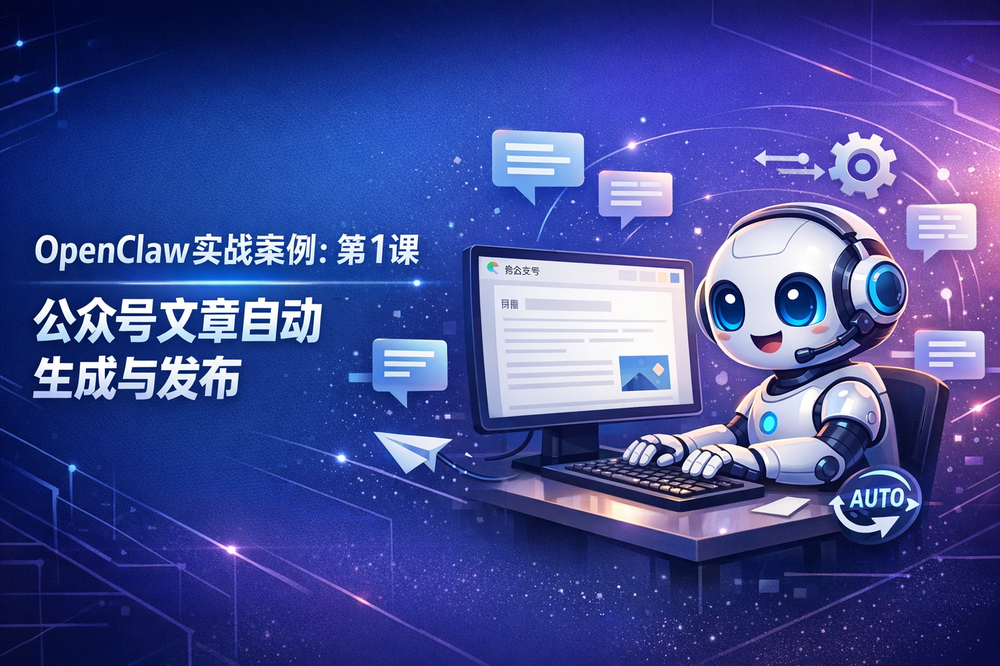
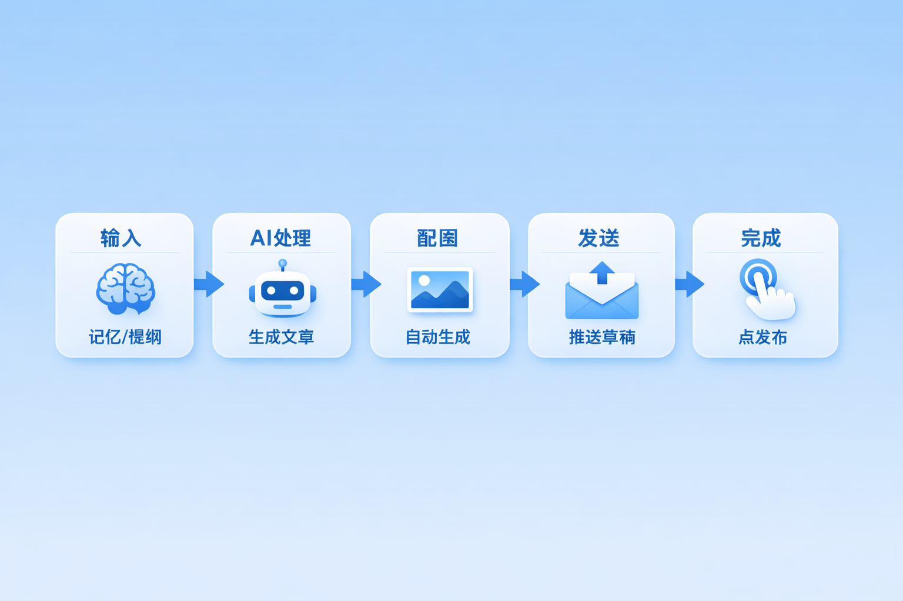
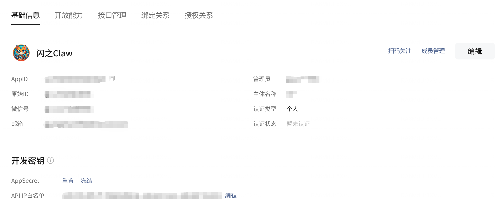
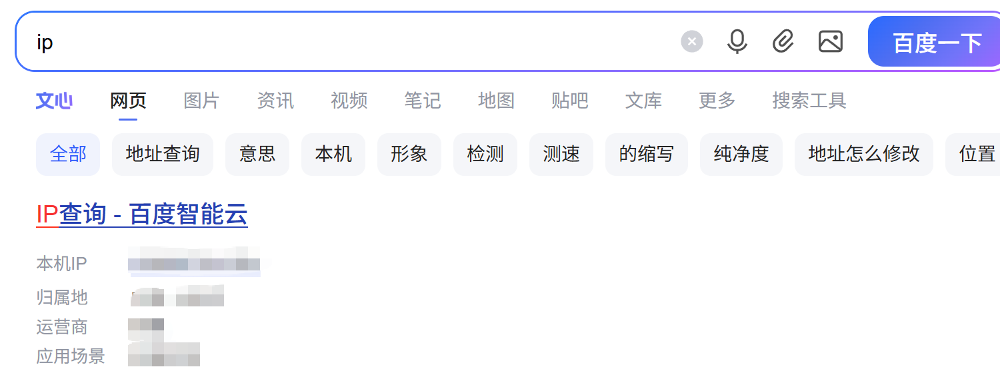
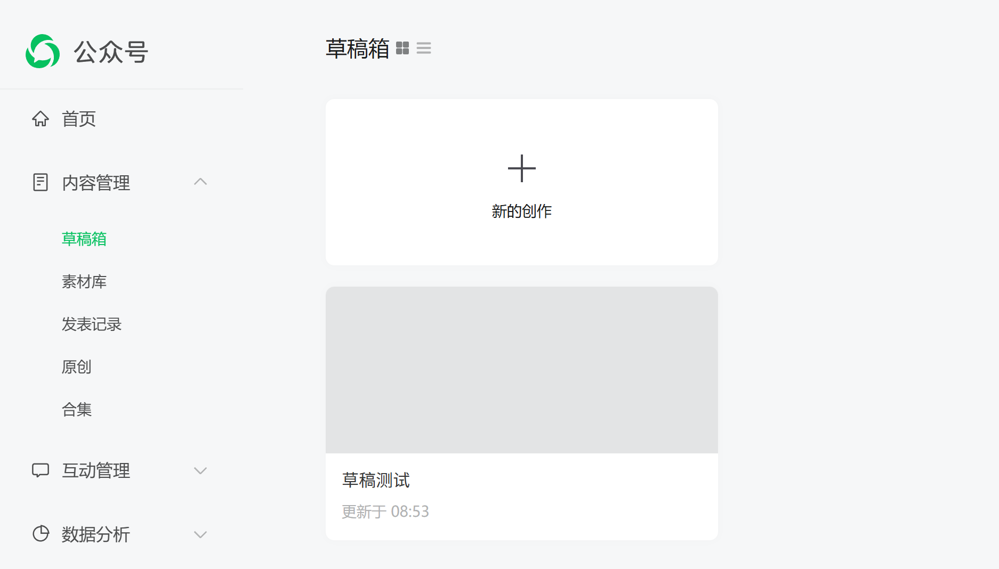

# 实战1：公众号文章自动生成与发布

> 从记忆到成文，全程不用动笔



你有没有算过，写一篇公众号文章要多久？

找素材半小时，起标题纠结二十分钟，正文写两小时，排版又是一小时……一天就这么过去了。更可怕的是，很多时候你明明有很多想法，却不知道怎么组织成一篇像样的文章。

今天我要教你一个「作弊」方法：**让 AI 帮你写完文章，再自动推到公众号草稿箱**。你唯一要做的，就是最后点一下「发布」。

这篇文章会手把手带你完成整套配置，大概需要 20 分钟。跟着做，你马上就能拥有一个 7×24 小时待命的「自媒体助手」。

---

## 先搞清楚我们要做什么

整个流程分成四步，看起来复杂，其实每一步都很简单：



```
你的记忆/提纲 → AI 生成文章 → 自动配图 → 推送公众号草稿箱 → 你点发布
```

进度：**0/4，接下来一步一步来**

---

## 第一步：安装 Skill 和依赖工具（5分钟）

### 1.1 下载 my-wechat-publish Skill

**最简单的方式：直接让 OpenClaw 帮你安装**

跟 OpenClaw 说：

> "帮我安装 https://github.com/HikariShine/AgentStudy/tree/main/skills/my-wechat-publish 这个 skill"

OpenClaw 会自动把 skill 下载到 `~/.openclaw/skills/` 目录，无需手动操作。

**手动安装方式（备用）**

如果自动安装失败，可以手动下载：

**Skill 下载地址**：https://github.com/HikariShine/AgentStudy/tree/main/skills/my-wechat-publish

下载后解压，将整个 `my-wechat-publish` 文件夹放到 `~/.openclaw/skills/` 目录下即可：

```
~/.openclaw/skills/
└── my-wechat-publish/
    ├── SKILL.md
    └── scripts/
        └── publish.js
```

### 1.2 安装 wenyan-cli

这个 skill 依赖 `wenyan-cli`，它是一个把 Markdown 转成公众号格式的工具。打开终端，复制粘贴下面这行命令：

```bash
sudo npm install -g @wenyan-md/cli
```

**心理辅导时间**：如果看到满屏的 WARN 黄色警告，不用管，只要最后没报错（没有出现红色的 ERROR），就是装成功了。

装好后验证一下：

```bash
wenyan --version
```

如果看到版本号（比如 `1.0.0`），恭喜你，第一步完成。

### 1.3 重启openclaw并开启新对话

openclaw gateway restart 重启，使用 /new 开启新对话，新对话中skill就会自动加载了

**进度：1/4 ✓**

---

## 第二步：配置微信公众号 API（10分钟）

这是整个流程里最「技术」的一步，但别担心，按我说的做，肯定能搞定。

### 2.1 注册微信公众号（如果还没有）

如果你已经有公众号，直接跳到 2.2 节。

还没有的话，注册很简单，全程在手机上就能完成：

1. **下载「订阅号助手」APP**（iOS/Android 都有）
2. **打开 APP → 点击「注册」**
3. **选择账号类型**：个人选择「订阅号」（免费，每天可群发 1 次）
4. **填写信息**：
   - 邮箱（未绑定过其他公众号的）
   - 设置密码
   - 验证邮箱
5. **实名认证**：需要绑定身份证 + 微信实名认证
6. **设置公众号名称**：想好名字，一年只能改 2 次，谨慎选择
7. **完成注册**

注册完成后，你就能在「订阅号助手」APP 里管理公众号了。接下来要获取 API 凭证，需要用到网页版后台。

### 2.2 获取公众号的 AppID 和 AppSecret

1. 登录 微信开发者平台
3. 页面往下拉，找到「公众号」，点击打开新页面，如下
   - 复制「AppID」
   - 点击「AppSecret」那一行的「重置」按钮（如果之前没保存过的话），微信会让你扫码验证，验证后就能看到了

**重要提醒**：AppSecret 只显示一次，复制下来先存到备忘录里！



### 2.3 添加 IP 白名单

OpenClaw 帮你发文章时，需要调用微信的接口。微信为了安全，只允许特定的 IP 地址访问。

在同一页面往下翻，找到「API IP白名单」，点击「配置」：

1. 先查一下你的外网 IP：
   打开百度 输入 ip 并搜索，可以看到自己的公网IP，也即下面的本机IP




2. 在公众号后台的 IP 白名单里添加这个 IP

**心理辅导时间**：如果你的网络环境会变（比如用移动网络、经常换 WiFi），IP 会变，到时候发不了文章。建议用固定的服务器，或者把常用的几个 IP 都加进去。

### 2.3 在 OpenClaw 里配置凭证

打开你的 OpenClaw 配置文件（通常是 `openclaw.json`），在 `skills.entries` 里添加：

```json
{
  "skills": {
    "entries": {
      "my-wechat-publish": {
        "env": {
          "WECHAT_APP_ID": "wx1234567890abcdef",
          "WECHAT_APP_SECRET": "1234567890abcdef1234567890abcdef"
        }
      }
    }
  }
}
```

把刚才复制的 AppID 和 AppSecret 替换进去。

**保存，重启 OpenClaw**。

**进度：2/4 ✓**

---

## 第三步：测试发布一篇文章（5分钟）

配置完成了，现在来跑通全流程。

### 3.1 用一句话让 AI 生成并发布测试文章

直接跟 OpenClaw 说：

> "帮我写一篇测试文章，标题是『我的 OpenClaw 会自动写稿了！』，内容是介绍 OpenClaw 能帮我自动生成公众号文章并自动配图发布，生成封面图，然后直接发布到公众号草稿箱"

OpenClaw 会自动：
1. 根据你的提示词生成文章内容
2. 润色、去 AI 痕迹
3. 生成封面图
4. 自动推送到公众号草稿箱

### 3.2 查看发布结果

如果一切正常，你会看到类似这样的输出：

```
✓ 生成文章内容
✓ 润色完成，去除 AI 痕迹
✓ 生成封面图片
✓ 推送到草稿箱
✓ 完成！请在公众号后台查看草稿
```

这时候有两种方式查看草稿：

**方式一：网页后台**  
打开 微信公众号后台，左侧「内容与互动」→「草稿箱」，你应该能看到刚推送的文章。



**方式二：公众号助手 APP**  
下载「公众号助手」APP，登录后点击底部的「发表」→「草稿箱」，同样能看到这篇文章。手机上预览效果更方便，确认无误后可以直接点击「发表」。

**进度：3/4 ✓**

---

## 第四步：完整工作流——从记忆/提纲到成文（自动化）

上面的测试是手动操作，现在我们要实现真正的「自动化」：你只需要说一句「帮我写一篇公众号文章」，剩下的 AI 全包。


### 4.1 方式一：让 AI 读取你的记忆

假设你每天都有记日记的习惯（或者让 OpenClaw 帮你记录重要事情），这些记忆都保存在 `memory/` 目录里。

你可以这样跟 OpenClaw 说：

> "帮我根据 2026-04-05 的记忆，生成一篇公众号文章，标题是『我的 AI 助手养成日记 01』，给文章配个封面图"

OpenClaw 会：
1. 读取当天的记忆文件
2. 自动润色、去 AI 痕迹
3. 生成几个备选标题供你选择
4. 生成封面图和正文配图（如果需要）
5. 自动推送到公众号草稿箱

### 4.2 方式二：给 AI 一个提纲，让它扩写

如果你没有现成的记忆，或者想写一篇特定主题的文章，可以给 AI 一个简单提纲。

比如这样跟 OpenClaw 说：

> "帮我写一篇公众号文章，主题是『为什么每个程序员都应该有自己的 AI 助手』，提纲如下：
> 1. 开头：讲一个程序员加班到深夜的场景
> 2. 痛点：列举重复性工作的烦恼
> 3. 转折：介绍 AI 助手能帮什么忙
> 4. 案例：列举 3 个具体使用场景
> 5. 结尾：呼吁读者尝试
> 生成封面图和正文配图，然后发布到公众号"

AI 会根据你的提纲扩写成完整文章，结构清晰、内容充实，不需要你自己动笔。

**小提示**：提纲越详细，生成出来的文章越符合你的预期。如果只有一句话主题，AI 会自由发挥；如果有明确提纲，AI 会严格按结构来写。

### 4.3 AI 写作的秘密武器：去 AI 痕迹

你可能担心：AI 写的文章会不会很「AI 味」？

放心，`my-wechat-publish` 这个技能内置了一套「去 AI 痕迹」的流程，包括：

- **删除意义膨胀句**：把「标志性里程碑」改成具体事实
- **去掉虚假权威**：不写「专家认为」，要么写具体来源，要么直接说
- **换掉 AI 高频词**：「赋能」「闭环」「底层逻辑」这些词，通通换成大白话
- **去掉填充短语**：「值得注意的是」「总体来说」「不难发现」——删
- **拒绝空洞结尾**：不写「未来可期」，给实际结论或行动项

写出来的文章，读起来就像是你自己敲的。

### 4.4 配图怎么办？

文章需要配图时，OpenClaw 会主动问你：

> 📸 文章准备就绪！需要我帮你生成配图吗？
> - 封面图（cover，建议 1080×864）
> - 正文插图（根据段落主题生成）
> - 不需要，直接发布

如果你选择生成，AI 会根据文章标题和内容，自动生成合适的图片。比如文章讲「AI 助手」，可能会生成一张温馨的机器人插画；讲「效率工具」，可能是简洁的办公场景。

生成的图片会自动保存到文章目录，用绝对路径引用到 frontmatter 里。

**进度：4/4 ✓ 最难的部分已经过了！**

---

## 常见问题 & 排雷指南

配置过程中可能会遇到一些问题，提前给你打好预防针：

| 问题 | 原因 | 解决方法 |
|------|------|---------|
| 提示 "IP 不在白名单" | 你的外网 IP 变了，或者没加白名单 | 报错信息里会有公网IP，把这个IP加到公众号后台白名单即可 |
| 提示 "缺少 frontmatter" | Markdown 文件顶部没有 title 和 cover | 确保文件开头有 `---` 包裹的 title 和 cover |
| 封面图上传失败 | 用了相对路径 | 把 `./cover.jpg` 改成 `/home/shine/.../cover.jpg` |
| wenyan 命令找不到 | 没装成功或环境变量问题 | 重新运行 `npm install -g @wenyan-md/cli` |
| 文章推送成功但格式错乱 | Markdown 语法不兼容 | 避免用太复杂的表格和嵌套列表 |

---

## 恭喜！你跨过了这道门槛

现在，你已经拥有了一个完整的「公众号自动化工作流」：

✅ 安装好了 Skill 和 wenyan-cli  
✅ 配置好了微信公众号 API  
✅ 测试发布了一篇文章  
✅ 学会了让 AI 从记忆或提纲生成文章并自动配图

接下来你可以：
- 每天让 AI 读你的记忆，自动生成日报/周报
- 给 AI 一个主题，让它帮你写系列文章
- 把这套流程和定时任务结合，让 OpenClaw 定期帮你输出内容

**下一步预告**：实战2 会教你如何把这套流程和 视频投稿结合起来——AI 写文案、生成视频、自动投稿，一条命令全搞定。

---

*文章生成时间：2026-04-05*  
*Skill 版本：my-wechat-publish v1.0*
